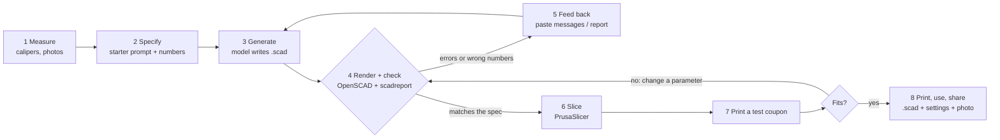
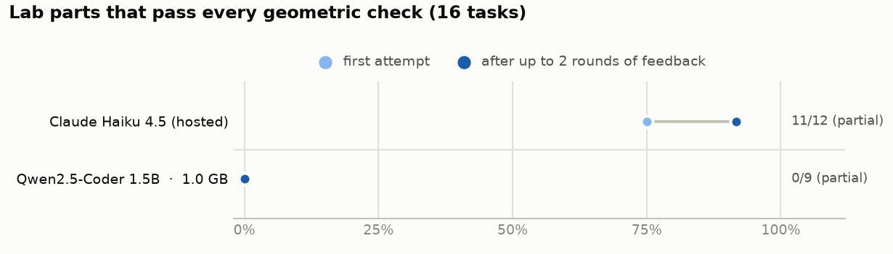
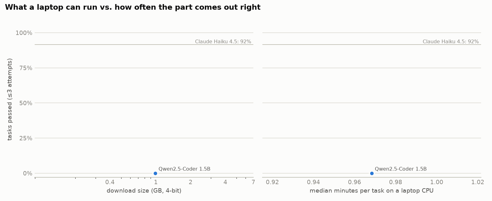

# Prompt to Bench: language models as a no-CAD entry point to 3D printing for biology labs

**Seb** ([@ATinyGreenCell](https://github.com/ATinyGreenCell)) and contributors

*Living preprint, v0.1 (5 October 2026). This README **is** the paper. It is open for corrections, new tasks, new designs, new models and new languages - see [How to contribute](#how-to-contribute).*

> **In this repository:** the paper (this page) · [student tutorial](tutorial/README.md) · [16 tested OpenSCAD lab designs](designs/) · [the Prompt-to-Bench benchmark](bench/) · [`scadreport`](tools/scadreport.py), a geometry-feedback tool you can use with any chatbot · licences: text CC BY 4.0, designs CERN-OHL-P-2.0, code MIT.

---

## Abstract

<!-- AUTO:abstract -->
Biology labs run on small plastic parts: tube racks, gel combs, adapters, knobs, brackets and housings. A desktop 3D printer can make them for cents, but designing them has required CAD skills that most biologists never acquire. Large language models (LLMs) remove much of that barrier when the CAD is written as code. A user describes a part in plain words and measured numbers, the model writes an OpenSCAD program, and the user renders, checks and prints it. We describe this workflow and the practices that make it reliable for people with no CAD training. We release 16 tested, parametric designs across four kinds of lab prints: benchware, tools, quick fixes and parts of full instruments. Together they print in 31.6 h from 483 g of PLA (about US$12) on a Prusa MK4. We also release a benchmark that scores model-written OpenSCAD against hidden geometric checks, and a feedback tool that measures the part a model actually built. To ask how small a model can be, we ran 14 open-weight models (0.4-6.6 GB) fully offline on a 2022 laptop CPU with no GPU, and two hosted Claude models as a reference. *Results are being filled in as the benchmark completes; see [Results](#6-results).*
<!-- /AUTO:abstract -->

---

## 1. Introduction

Every biology lab depends on a long tail of small, specific objects. Examples include a rack that fits the tubes this lab actually uses, a comb for a home-made gel tray, an adapter that lets one consumable sit in another's holder, a knob to replace the one that cracked, and a bracket for a pump motor. Commercial versions are often expensive, slow to arrive or simply not made. Desktop 3D printing turned many of these objects into an afternoon's work. Over a decade of "open labware" has shown that printed and open-source equipment can match commercial tools for a fraction of the cost ([Pearce 2012](#pearce2012); [Baden et al. 2015](#baden2015); [Coakley & Hurt 2016](#coakley2016); [Pearce 2020](#pearce2020)). It has also shown that open hardware matters most where budgets and supply chains are thinnest ([Maia Chagas 2018](#maiachagas2018); [Wenzel 2023](#wenzel2023)). In one recent collection of 26 printable lab items, the printed versions cost on average 8.18% of their commercial equivalents ([McNair et al. 2024](#mcnair2024)).

The printer is no longer the bottleneck; design is. Turning "I need something that holds six 50 mL tubes upright" into a printable file usually means learning a CAD program. Among programmers of open labware, the most common choice is **OpenSCAD** ([OpenSCAD developers](#openscad)), a free tool in which a part is written as a short program of solids, Boolean operations and loops ([Machado et al. 2019](#machado2019)). OpenSCAD underlies widely used open instruments such as the OpenFlexure microscope ([Collins et al. 2020](#collins2020)), the FlyPi ([Maia Chagas et al. 2017](#maiachagas2017)), a parametric syringe-pump library ([Wijnen et al. 2014](#wijnen2014)) and printable optics ([Zhang et al. 2013](#zhang2013)). It also appears in a steady stream of recent biology tools ([Subbaraman et al. 2024](#subbaraman2024); [Keene-Snickers et al. 2025](#keenesnickers2025); [Yamazaki et al. 2025](#yamazaki2025); [Bhupathi et al. 2026](#bhupathi2026); [Algarín et al. 2026](#algarin2026)). Its users report the hard parts to be spatial reasoning, validation and debugging ([Gonzalez Avila et al. 2024](#gonzalezavila2024)).

Code is exactly what large language models write well. Because OpenSCAD designs are text, a researcher can describe a part in plain language and let a model draft the program. Researchers already used GPT-4 in this way to design OpenSCAD microfluidic components ([Nelson et al. 2023](#nelson2023)). Benchmarks of frontier models find OpenSCAD among the most reliable code-CAD formats ([Jones et al. 2025](#jones2025); [Yang et al. 2026](#yang2026)). OpenSCAD's own developers are building an experimental AI assistant that talks to a local model by default ([OpenSCAD GSoC 2026](#openscadai2026)). In our own lab practice, a hosted frontier model (Claude) and OpenSCAD now take routine parts from idea to a print-ready file in minutes. That success is what prompted this paper.

Access to that combination is uneven. In 2025, 2.2 billion people were still offline, and fixed broadband cost more than a quarter of average income in low-income countries ([ITU 2025](#itu2025)). Generative-AI use was 24.7% of the population in the Global North against 14.1% in the Global South in late 2025 ([Microsoft AI Economy Institute 2026](#microsoft2026)). Hosted models are paid, are not offered in every country ([Anthropic, n.d.](#anthropicregions)), charge per token in ways that penalise many non-English languages ([Ahia et al. 2023](#ahia2023)), and can change availability at short notice ([Anthropic 2026](#anthropic2026)). Non-native English speakers already pay heavily to do science in English ([Amano et al. 2023](#amano2023)). **Open-weight** models that run on a student's own laptop, offline and for free, could close much of this gap. But there are two reasons to doubt that small models can do the job. OpenSCAD is a very low-resource programming language: openly licensed code corpora contain roughly a thousand times less OpenSCAD than Python ([Kocetkov et al. 2022](#kocetkov2022); see [§5.5](#55-what-to-expect-from-small-models)). And small open models have performed poorly on CAD code generation without fine-tuning ([Badagabettu et al. 2024](#badagabettu2024); [Alrashedy et al. 2025](#alrashedy2025); [Dong et al. 2026](#dong2026)).

This paper asks three practical questions:

1. **Workflow.** What process, prompts and checks let someone with no CAD training get a correct, printable lab part from a language model?
2. **Model size.** What is the *smallest* open-weight model that is genuinely useful for this when it runs offline on an ordinary laptop?
3. **Language.** Does writing the request in Spanish, Hindi or Swahili instead of English change the answer?

**Contributions.**

- A workflow and best-practice rules for LLM-assisted design of lab parts, with a copy-paste starter prompt ([§3](#3-the-workflow), [§4](#4-best-practices)).
- 16 tested, parametric OpenSCAD designs in four categories: benchware, tools, quick fixes and parts of full instruments ([§2](#2-what-labs-print-four-kinds-of-parts), [`designs/`](designs/)).
- `scadreport`, a small tool that renders an OpenSCAD file and reports what was actually built: size, holes, spacing, wall layout, overhangs. Its output can be pasted into any chatbot ([`tools/`](tools/)).
- **Prompt-to-Bench-16**, a benchmark of 16 realistic design requests with hidden, symmetry-aware geometric checks, validated against its own reference solutions ([§5](#5-benchmark-prompt-to-bench-16)).
- An evaluation of 14 open-weight models running CPU-only and offline, with hosted Claude models as a reference, plus a language ablation ([§6](#6-results)).
- A student tutorial ([`tutorial/`](tutorial/README.md)). Everything is open, and the benchmark runs on a laptop so that others can add results from their own hardware and languages.

## 2. What labs print: four kinds of parts

We group lab prints into four kinds. They differ in what can go wrong, so they also differ in what a model must get right.

| Kind | Examples | What must be right | Typical risk |
|---|---|---|---|
| **Benchware** (holds, organises, stores) | tube and slide racks, plate-format holders, pipette stands, tip-box adapters | hole counts, spacing, standard footprints (e.g. ANSI/SLAS microplate) | low - wrong sizes waste plastic |
| **Tools** (used in a protocol) | gel combs, micropestles, funnels, seed-sowing and colony templates, spreaders | key dimensions, surface finish, material compatibility | low-moderate - contamination, chemical attack |
| **Quick fixes** (replace or adapt a part) | knobs for D-shafts, tube adapters, hose barbs, clips, feet, covers | a precise fit to an existing object, measured with calipers | moderate - fit and load; never for safety-critical parts |
| **Full hardware** (parts of instruments) | stirrer housings, pump and motor brackets, enclosures, gel tanks, microscope parts | interfaces between parts, fasteners, assembly tolerances, electronics | higher - mechanical, electrical and biosafety hazards ([§8](#8-safety-and-responsibility)) |

Our 16 reference designs cover all four kinds (Figure 1). Each one is a single OpenSCAD file with all dimensions as named parameters at the top, in [Customizer](https://files.openscad.org/documentation/manual/Customizer.html) sections, so they can be adapted without editing code. Each is modelled in print orientation and prints without supports. Sliced with PrusaSlicer ([Prusa Research](#prusaslicer)) for an Original Prusa MK4 (0.4 mm nozzle, 0.20 mm SPEED profile, Prusament PLA), the whole set takes 31.6 h and 483 g of filament, about US$12 of PLA at US$25/kg (Table 1).

<p align="center"></p>

**Figure 1.** The 16 reference designs, which are also the benchmark's answer key. All are in [`designs/`](designs/), each with print notes in its header.

<details>
<summary><b>Table 1.</b> Print-time and filament estimates for an Original Prusa MK4 (click to expand)</summary>

<!-- AUTO:table-prints -->
| Part | Kind | Print time | PLA (g) | Material cost (US$) |
|---|---|---:|---:|---:|
| 24-place 1.5 mL tube rack | Benchware | 5h 23m 24s | 78.7 | 1.97 |
| 50 mL conical tube rack, printed inverted | Benchware | 4h 14m 10s | 69.4 | 1.73 |
| Microscope slide drying rack | Benchware | 2h 5m 6s | 41.8 | 1.05 |
| 96-place PCR tube rack, SBS footprint | Benchware | 8h 2m 5s | 93.3 | 2.33 |
| 10-well agarose gel comb | Tools | 10m 51s | 2.5 | 0.06 |
| Micropestle for 1.5 mL tubes | Tools | 26m 34s | 1.9 | 0.05 |
| 60 mm lab funnel | Tools | 34m 15s | 7.1 | 0.18 |
| Seed-sowing template for a 90 mm Petri dish | Tools | 52m 39s | 12.8 | 0.32 |
| Replacement knob for a 6 mm D-shaft | Quick fixes | 21m 8s | 5.0 | 0.12 |
| 0.2 mL-in-1.5 mL tube adapter sleeve | Quick fixes | 10m 33s | 1.5 | 0.04 |
| Hose-barb reducer, 8 mm to 5 mm tubing | Quick fixes | 17m 48s | 1.7 | 0.04 |
| Snap-on tubing clip for a lab stand rod | Quick fixes | 7m 14s | 1.6 | 0.04 |
| Magnetic stirrer housing for an 80 mm PC fan | Full hardware | 2h 57m 58s | 53.0 | 1.32 |
| NEMA 17 motor L-bracket | Full hardware | 59m 38s | 14.3 | 0.36 |
| Electronics enclosure with push-fit lid | Full hardware | 1h 41m 2s | 34.0 | 0.85 |
| Mini gel-electrophoresis buffer tank | Full hardware | 3h 21m 15s | 64.3 | 1.61 |
| **All 16 parts** | | **31.6 h** | **483** | **12.07** |
<!-- /AUTO:table-prints -->

Estimates are from PrusaSlicer 2.9.6 with the stock "0.20mm SPEED @MK4 0.4" profile and "Prusament PLA @PG". Filament mass assumes 1.24 g/cm³; cost assumes US$25/kg. Reproduce with `python tools/slice_library.py`.
</details>

## 3. The workflow



**Figure 2.** The Prompt-to-Bench loop. The model does the CAD; the human measures, checks and decides. Steps 4-5 can be automated by an agent such as Claude Code, or done by hand with any chatbot.

The loop has two features that matter more than the choice of model.

**The specification carries the knowledge.** The user supplies measured numbers, the print orientation and the coordinate frame (for example, "the base lies on the bed at z = 0"). The model is never asked to remember the outside diameter of a 50 mL tube or the hole pattern of a fan. Standard dimensions (such as ANSI/SLAS microplate footprints, 80 mm fan hole spacing and NEMA 17 bolt patterns) are written into the request ([ANSI/SLAS 2004](#slas2004); [SUNON](#sunon); [Oriental Motor](#orientalmotor)).

**The model must be shown what it built.** A language model cannot see its part. When OpenSCAD fails, its error messages go back to the model. When the file renders but the part is wrong, the most useful feedback is a plain-text *measurement* of the result, not "it's wrong". We wrote `scadreport` for this. It renders the file and reports whether the result is a single watertight solid, its bounding box and volume, how it sits on the bed and where it overhangs. It also slices the part horizontally at every distinct height and lists each hole's shape, size and grid spacing. A typical excerpt for a rack whose pitch came out wrong:

```
SOLID: 1 separate body, watertight (valid solid); volume 158,139 mm3 (~196 g of PLA if printed solid).
BOUNDING BOX: X -53.00 .. 53.00 (size 106.00) | Y -36.00 .. 36.00 (size 72.00) | Z 0.00 .. 30.00 (size 30.00) mm
  z=15.00: 1 solid region [outline: rectangle 106.00 x 72.00 centred (0.00, 0.00)]; 24 holes:
           24 x circle d=11.19 [6 x 4 grid (X x Y), pitch X 15.00 / Y 15.00, grid centre (0.00, 0.00)]
```

A user, or the model itself, can now compare "pitch 15.00" with the "16 mm" in the request. The report does not know what was wanted, so it works for any part.

## 4. Best practices

These rules come from our own use of the workflow, from the benchmark below and from the cited literature, and complement general guides to 3D printing in chemistry and biology labs ([Pamidi et al. 2024](#pamidi2024); [Saggiomo 2022](#saggiomo2022)). Each is reflected in the tutorial and in the reference designs.

1. **Measure; don't rely on memory - yours or the model's.** Give caliper numbers for everything that must fit. A model will happily invent "standard" dimensions.
2. **State the print orientation and the frame.** Say which face sits on the bed at z = 0, and which way is +X. Most "wrong" parts in practice are right shapes in the wrong place or upside down.
3. **Use a starter prompt.** A short system prompt fixes the style: millimetres, named parameters, built-in OpenSCAD only, cutters that overshoot faces, `$fn` for round holes, `for` loops for arrays ([`bench/prompts/system.md`](bench/prompts/system.md), reproduced in the tutorial). Putting best-practice lists in the prompt also helped GPT-4 in earlier CAD work ([Makatura et al. 2023](#makatura2023)).
4. **Ask for parameters, then stop asking.** Once a design works, change its numbers yourself (or in the Customizer) instead of regenerating it. The `.scad` file becomes a template for the next lab.
5. **Close the loop with measurements.** Paste OpenSCAD's messages and a `scadreport` back into the chat. Never accept a part you have not checked against the request.
6. **Print a coupon first.** Before an 8-hour print, print a 2-mm slice containing the critical holes or the mating feature. FDM holes tend to come out undersized ([Slic3r manual](#slic3r)). Start fits at about 0.2-0.3 mm clearance per side and calibrate for your printer and material ([Prusa Research, n.d.](#prusamodeling); [Popescu et al. 2023](#popescu2023)).
7. **Design for the printer.** Use a flat face on the bed, keep overhangs under about 45°, avoid long bridges and use walls of at least two extrusion widths. Print things upside down when that removes supports; two of our designs (the 50 mL rack and the stirrer housing) are modelled that way.
8. **Choose material for the lab, not the printer.** PLA softens around 55-60 °C, so it is not for autoclaves, hot water baths or heat blocks. PETG (heat deflection temperature, HDT, 68 °C) and even polycarbonate also deform in a 121 °C autoclave ([Pérez Davila et al. 2021](#perezdavila2021); [Rynio et al. 2022](#rynio2022); [Popescu et al. 2025](#popescu2025); [Prusament TDS](#prusament)). Brief wipes with 70% ethanol, isopropanol or dilute hypochlorite are fine on PLA ([Vaňková et al. 2020](#vankova2020)); long soaks weaken parts ([Kaptan 2025](#kaptan2025)).
9. **Know what not to print.** Do not print rotors or adapters for commercial centrifuges ([Eppendorf](#eppendorf)), pressure vessels, mains-powered enclosures without proper electrical design ([IEC 61010-1](#iec61010)), or anything that touches patients. See [§8](#8-safety-and-responsibility).
10. **Share the source, not just the STL.** The editable `.scad` file is the "source" of open hardware ([Bonvoisin et al. 2017](#bonvoisin2017); [Diederich et al. 2022](#diederich2022)). Add the print settings and a photo, and say which model and prompt produced it.
11. **Keep private work local.** Unpublished or client designs should not be pasted into hosted services you do not control. A local model keeps them on your machine.
12. **Match the model to the part.** *To be finalised from the results in [§6](#6-results).*

## 5. Benchmark: Prompt-to-Bench-16

### 5.1 Tasks

Each task is a design request as a careful student would write it after measuring with calipers. It gives dimensions in millimetres, the print orientation, the frame where it matters, and plain-language feature descriptions. There are four tasks in each of the four categories (Table 2), spanning blind and through holes, 1-D and 2-D arrays (up to 96 holes in the ANSI/SLAS microplate footprint), slots, teeth, revolved profiles, polar arrays, D-shaped bores, open rings, horizontal holes, multi-part layouts and clearance fits. Full prompts are in [`bench/tasks.yaml`](bench/tasks.yaml).

| Category | Task | What it exercises |
|---|---|---|
| Benchware | 24-place 1.5 mL tube rack | block, blind holes, 6 x 4 grid |
| Benchware | 50 mL conical tube rack, printed inverted | print orientation, through holes, walls |
| Benchware | Microscope slide drying rack | ten 1.6 mm slots, small clearances |
| Benchware | 96-place PCR tube rack, SBS footprint | standard footprint, 96-hole grid, orientation chamfer |
| Tools | 10-well agarose gel comb | flat 2-D profile, tooth array |
| Tools | Micropestle for 1.5 mL tubes | stacked primitives, cone, grooves at given heights |
| Tools | 60 mm lab funnel | hollow solid of revolution, open ends |
| Tools | Seed-sowing template for a 90 mm Petri dish | disc, 49-hole grid, orientation notch |
| Quick fixes | Replacement knob for a 6 mm D-shaft | D-profile bore, 18-groove polar array, aligned pointer |
| Quick fixes | 0.2 mL-in-1.5 mL tube adapter sleeve | concentric cylinders, upside-down printing |
| Quick fixes | Hose-barb reducer, 8 mm to 5 mm tubing | revolved sawtooth profile, through bore |
| Quick fixes | Snap-on tubing clip for a lab stand rod | 2-D Booleans, open rings, explicit coordinates |
| Full hardware | Magnetic stirrer housing for an 80 mm PC fan | shelled box, bolt pattern, cable notch |
| Full hardware | NEMA 17 motor L-bracket | horizontal holes, bolt patterns, gussets |
| Full hardware | Electronics enclosure with push-fit lid | two bodies, 0.2 mm clearance fit |
| Full hardware | Mini gel-electrophoresis buffer tank | internal platform, chambers, electrode holes |

**Table 2.** The 16 tasks. The reference solutions are the designs in Figure 1.

### 5.2 Hidden geometric checks

The model never sees the checks. A candidate file is rendered with OpenSCAD using the Manifold geometry kernel ([Lalish et al.](#manifold)) and the mesh is normalised: bounding-box centre at the origin in XY, lowest point at z = 0. It is then compared with the specification using four kinds of test:

- **global checks:** bounding box, number of bodies, watertightness and volume within 5-15% of the reference;
- **horizontal sections at chosen heights:** number of solid regions and holes, hole diameters or rectangle sizes, hole-centre positions and grids, and cross-section areas;
- **probe points** that must be solid or empty, for features like notches, chamfers and horizontal holes;
- **line and arc probes** that count solid intervals, for comb teeth and grip grooves.

Rotating a part by 90° about Z or mirroring it does not change how it prints or works, so position-dependent checks are evaluated under all eight symmetries of the bed and the best match is kept. A part *passes* only if every check passes. Dimensional tolerances are 0.25-0.6 mm, which is about what a careful FDM print achieves anyway ([Li et al. 2025](#li2025)).

We validated the checker with [`bench/build_refs.py`](bench/build_refs.py):

- all 16 reference solutions pass their own checks;
- they still pass after being rotated, mirrored and moved;
- they fail when scaled by 3%;
- none passes another task's checks (0/240 cross-task false positives).

This validation caught an error in one of our own reference designs. A 7 x 7 grid of seed holes at 10 mm pitch placed the corner holes 42.4 mm from the centre of an 85 mm disc, so they broke through the rim. We changed the pitch to 9 mm. It is a small example of the workflow's main lesson: geometry should be measured, not assumed.

### 5.3 Protocol

- **Prompt:** every model receives the same system prompt ([`bench/prompts/system.md`](bench/prompts/system.md)) followed by the task text.
- **Code extraction:** the answer is the longest fenced OpenSCAD block in the reply.
- **Feedback loop:** if the part does not pass, the model gets one message and tries again, up to two repairs (three attempts). The message is either OpenSCAD's own errors and warnings (when nothing printable was produced) or the generic `scadreport` measurement report with the instruction to compare it with the specification (when a part rendered but failed). The hidden checks are never revealed. This mimics a user who notices the part is wrong and pastes the report back.
- **Local models:**
  - Run through Ollama 0.30.11 with 4-bit weights (Q4_K_M), temperature 0.2, top-p 0.95, a fixed seed per attempt and an 8,192-token context.
  - Replies are streamed. A reply ends at 2,048 tokens, as soon as a complete OpenSCAD code block has arrived, or when the model starts repeating itself verbatim. A correct solution needs about 400-700 tokens.
  - "Thinking" is switched off for models that support it, so that every local model answers directly and runs at a comparable cost.
- **Hosted reference:** Claude Haiku 4.5 and Claude Sonnet 5.5 run through the Claude Code command line in print mode, with the system prompt replaced by ours, all tools disabled and default settings otherwise. That includes extended thinking: this is Claude as a student would actually use it, not an equal-cost comparison.
- **Hardware:** a 2022 laptop with an Intel Core i7-1260P (12 cores, 16 threads), 16 GB RAM (14 GiB usable), no discrete GPU (the integrated GPU was not used), Ubuntu, OpenSCAD 2026.10.01 (development snapshot) and PrusaSlicer 2.9.6. Models ran one at a time, so the timings are clean.

### 5.4 Models

<!-- AUTO:table-models -->
| Model | Family | Parameters | Download | Licence |
|---|---|---|---:|---|
| Qwen2.5-Coder 0.5B (`qwen2.5-coder:0.5b`) | Qwen2.5-Coder | 0.49B | 0.4 GB | Apache-2.0 |
| Qwen2.5-Coder 1.5B (`qwen2.5-coder:1.5b`) | Qwen2.5-Coder | 1.54B | 0.99 GB | Apache-2.0 |
| Qwen2.5 1.5B (general) (`qwen2.5:1.5b`) | Qwen2.5 | 1.54B | 0.99 GB | Apache-2.0 |
| Qwen3.5 2B (`qwen3.5:2b-q4_K_M`) | Qwen3.5 | 2.27B | 1.9 GB | Apache-2.0 |
| Qwen2.5-Coder 3B (`qwen2.5-coder:3b`) | Qwen2.5-Coder | 3.09B | 1.9 GB | Qwen Research (non-commercial) |
| Llama 3.2 3B (`llama3.2:3b`) | Llama 3.2 | 3.21B | 2 GB | Llama 3.2 Community |
| Granite 4.2 3B (`granite4.2:3b`) | Granite 4.2 | 3B | 2.2 GB | Apache-2.0 |
| Ministral 3 3B (`ministral-3:3b`) | Ministral 3 | 3.4B | 3 GB | Apache-2.0 |
| Qwen3.5 4B (`qwen3.5:4b-q4_K_M`) | Qwen3.5 | 4.66B | 3.3 GB | Apache-2.0 |
| Gemma 4 E2B (`gemma4:e2b-it-q4_K_M`) | Gemma 4 | 2.3B effective, 5.1B with per-layer embeddings | 4.6 GB | Apache-2.0 |
| Qwen2.5-Coder 7B (`qwen2.5-coder:7b`) | Qwen2.5-Coder | 7.61B | 4.7 GB | Apache-2.0 |
| LFM2.5 8B-A1B (MoE) (`lfm2.5:8b-a1b-q4_K_M`) | LFM2.5 | 8.3B total, ~1.5B active per token | 5.2 GB | LFM Open v1.0 (revenue cap) |
| Gemma 4 E4B (`gemma4:e4b-it-q4_K_M`) | Gemma 4 | 4.5B effective, 8B with per-layer embeddings | 6.6 GB | Apache-2.0 |
| Qwen3.5 9B (`qwen3.5:9b-q4_K_M`) | Qwen3.5 | 9.65B | 6.6 GB | Apache-2.0 |
| Claude Haiku 4.5 (hosted) (`claude:claude-haiku-4-5`) | Claude | - | hosted | proprietary API |
| Claude Sonnet 5.5 (hosted) (`claude:claude-sonnet-5-5`) | Claude | - | hosted | proprietary API |
<!-- /AUTO:table-models -->

The 14 local models come from eight families: Qwen2.5-Coder ([Hui et al. 2024](#hui2024)), Qwen2.5 ([Qwen Team 2024](#qwen2024)), Qwen3.5 ([Qwen Team 2026](#qwen2026)), Gemma 4 ([Gemma Team 2026](#gemma2026)), Ministral 3 ([Liu et al. 2026](#liu2026)), Granite 4.2 ([IBM Granite Team 2026](#ibm2026)), LFM2.5 ([Liquid AI 2026](#liquid2026)) and Llama 3.2 ([Meta 2024](#meta2024)). All run through Ollama ([Ollama](#ollama)) on llama.cpp ([Gerganov et al.](#llamacpp)) as 4-bit GGUF files ([Kawrakow 2023](#kawrakow2023)). Model sizes are Ollama download sizes; licences are from the model cards (accessed 5 Oct 2026). "Open-weight" is not the same as open source, and licences differ in ways that matter for labs that sell services. The Qwen2.5-Coder 3B weights are licensed for non-commercial use only, LFM2.5 has a revenue threshold for commercial use, and Llama 3.2 has its own community licence ([Qwen 2024](#qwen3blicense); [Liquid AI 2026](#liquid2026); [Meta 2024](#meta2024)). Exact model tags and digests are in [`bench/logs/model_digests.txt`](bench/logs/model_digests.txt).

### 5.5 What to expect from small models

Two pieces of prior evidence set low expectations.

**OpenSCAD is a low-resource language.** In The Stack, an openly licensed code corpus used to pretrain many code models, the OpenSCAD folder is about 0.03 GB of compressed data, against about 47 GB for Python and 1.6 GB for Lua ([Kocetkov et al. 2022](#kocetkov2022); [Lozhkov et al. 2024](#lozhkov2024)). Lua is itself the usual example of a "low-resource" language in code-model research ([Cassano et al. 2024](#cassano2024)). Quantised 7B code models running on a CPU-only laptop already score below 50% on Lua benchmarks ([Nyamsuren 2025](#nyamsuren2025)).

**Small models have done poorly at CAD code without fine-tuning.** CodeLlama-70B produced "extremely bad" FreeCAD output in one study ([Badagabettu et al. 2024](#badagabettu2024)). Open models compiled less often than GPT-4 in another ([Alrashedy et al. 2025](#alrashedy2025)). On a 2026 text-to-CAD assembly benchmark, open-weight models of 8B parameters and up scored about 3-4%, against about 20% for the best closed models ([Dong et al. 2026](#dong2026)). The small-model successes in the literature come from fine-tuning on narrow CAD datasets ([Rukhovich et al. 2025](#rukhovich2025); [Govindarajan et al. 2026](#govindarajan2026); [Xie & Ju 2025](#xie2025)). We test general-purpose and code models as a student would download them, with no fine-tuning.

**Defining "minimal viable".** Before running the benchmark we fixed what we would call a minimally viable local model: one that passes at least **half of the 16 tasks within three attempts**, runs on a 16 GB laptop without a GPU, and needs a median of at most **10 minutes per task**. The *minimal* viable model is the smallest download that meets all three.

## 6. Results

### 6.1 Overall

<!-- AUTO:fig-pass-rates -->
<picture>
  <source media="(prefers-color-scheme: dark)" srcset="figures/fig_pass_rates_dark.png">
  
</picture>
<!-- /AUTO:fig-pass-rates -->

**Figure 3.** Share of the 16 tasks whose part passed every hidden check, on the first attempt (light) and after up to two rounds of feedback (dark). Local models are ordered by download size.

<!-- AUTO:table-main -->
| Model | Download | Licence | Pass, 1st try | Pass, ≤3 tries (95% CI) | Printable 1st try | Median min/task | Tokens/s |
|---|---:|---|---:|---:|---:|---:|---:|
| Claude Haiku 4.5 (hosted) *(partial)* | hosted | proprietary API | 9/12 | 11/12 (65-99%) | 11/12 | 1.9 | - |
| Qwen2.5-Coder 1.5B *(partial)* | 0.99 GB | Apache-2.0 | 0/9 | 0/9 (0-30%) | 2/9 | 1.0 | 16.5 |
<!-- /AUTO:table-main -->

**Table 3.** Main results. "Printable 1st try" means the first file rendered to a solid, whether or not it was correct. The 95% confidence intervals are Wilson intervals over 16 tasks. Tokens/s is generation speed on the laptop CPU.

<!-- AUTO:results-overall -->
*Narrative pending completion of the benchmark run.*
<!-- /AUTO:results-overall -->

### 6.2 By task and category

<!-- AUTO:fig-outcomes -->
<picture>
  <source media="(prefers-color-scheme: dark)" srcset="figures/fig_outcomes_dark.png">
  
</picture>
<!-- /AUTO:fig-outcomes -->

**Figure 4.** Outcome for every model and task. The number is the attempt that passed. "·" means the part rendered but never matched the spec; "×" means no printable part was produced.

<!-- AUTO:table-categories -->
| Model | Benchware | Tools | Quick fixes | Full hardware |
|---|---:|---:|---:|---:|
| Claude Haiku 4.5 (hosted) | 3/4 | 4/4 | 4/4 | - |
| Qwen2.5-Coder 1.5B | 0/4 | 0/4 | 0/1 | - |
<!-- /AUTO:table-categories -->

**Table 4.** Tasks passed within three attempts, by category (out of 4 each).

### 6.3 How models fail

<!-- AUTO:table-failures -->
| Model | no code | syntax error | render error | no solid | timeout | wrong geometry | pass |
|---|---:|---:|---:|---:|---:|---:|---:|
| Claude Haiku 4.5 (hosted) | 0 | 1 | 0 | 0 | 0 | 2 | 9 |
| Qwen2.5-Coder 1.5B | 0 | 5 | 1 | 1 | 0 | 2 | 0 |
<!-- /AUTO:table-failures -->

**Table 5.** Where each model's *first* attempt stopped: no code, a syntax or render error, no solid (an empty or 2-D result), a printable part with the wrong geometry, or a pass.

<!-- AUTO:results-failures -->
*Narrative pending completion of the benchmark run.*
<!-- /AUTO:results-failures -->

### 6.4 Size, speed and the minimal viable model

<!-- AUTO:fig-frontier -->
<picture>
  <source media="(prefers-color-scheme: dark)" srcset="figures/fig_frontier_dark.png">
  
</picture>
<!-- /AUTO:fig-frontier -->

**Figure 5.** Tasks passed within three attempts against model download size (left) and median CPU minutes per task (right). Horizontal lines mark the hosted reference models.

<!-- AUTO:results-frontier -->
*Narrative pending completion of the benchmark run.*
<!-- /AUTO:results-frontier -->

### 6.5 Language

<!-- AUTO:fig-languages -->
<!-- /AUTO:fig-languages -->

<!-- AUTO:results-language -->
*The language ablation (Spanish, Hindi and Swahili prompts with the English system prompt) runs after the main benchmark.*
<!-- /AUTO:results-language -->

## 7. Global access

**Cost.**

- A Prusa MK4S costs about US$650-1,000 (kit vs assembled; prices vary by region and promotion), and capable budget printers about US$200 ([Prusa Research](#prusaprice); [Bambu Lab](#bambuprice); [Creality](#crealityprice)).
- At that point the marginal cost of a part is small: our 16-part library uses about US$12 of PLA.
- OpenSCAD, PrusaSlicer, Ollama and the open-weight models are free.
- A hosted model needs a subscription or per-token payment in a currency many labs cannot easily use.

**Connectivity.**

- Everything in the local workflow runs offline once installed.
- The one-time downloads are the obstacle: the CAD and slicing software, plus 0.4-6.6 GB per model.
- In nine out of ten low-income economies, a 5 GB mobile data basket costs more than 10% of average monthly income ([ITU 2025b](#itu2025b)).
- We therefore recommend that teaching labs, maker spaces and organisations such as TReND ([Baden et al. 2020](#baden2020)) or the GOSH community ([GOSH 2017](#gosh2017)) distribute models on USB drives or local mirrors, not over metered connections.

**Availability and resilience.**

- The major hosted providers exclude a small set of countries and territories, including China, Russia and Iran ([Anthropic, n.d.](#anthropicregions); [OpenAI, n.d.](#openairegions); [Google, n.d.](#googleregions)). Most low-income countries are supported.
- Availability can still change: in June 2026 a US government directive suspended access to two frontier Anthropic models for "any foreign national" for 18 days, while other models stayed available ([Anthropic 2026](#anthropic2026)).
- A local model is a fallback that no policy change can switch off. It also keeps unpublished or confidential designs on the user's machine.

**Language.**

- Code models degrade on prompts in lower-resource natural languages, and the drop is far steeper for small open models than for frontier models ([Raihan et al. 2025](#raihan2025); [Ahuja et al. 2023](#ahuja2023)).
- Our language ablation ([§6.5](#65-language)) tests whether this holds for lab-part design.

**Hardware.** Our test machine is a mid-range 2022 ultrabook. A model that runs acceptably on it will run on many student laptops. Models over about 7 GB will not fit alongside a desktop session in 16 GB of RAM; see [§6.4](#64-size-speed-and-the-minimal-viable-model).

## 8. Safety and responsibility

A model that writes plausible CAD does not know your lab, your materials or your risks. The following points apply whatever model is used.

- **Materials and sterilisation.**
  - Fresh FDM prints can be close to sterile off the nozzle ([Neches et al. 2016](#neches2016)), but handling ends that, and layer lines harbour biofilm ([Hall et al. 2021](#hall2021)).
  - PLA cannot be autoclaved ([Neijhoft et al. 2023](#neijhoft2023)). PETG, PP and PC deform at 121 °C ([Rynio et al. 2022](#rynio2022); [Popescu et al. 2025](#popescu2025)).
  - UV-C degrades PETG faster than PLA ([Amza et al. 2021](#amza2021)).
  - Resin (SLA) prints can be toxic to sensitive organisms ([Macdonald et al. 2016](#macdonald2016)).
  - For cell culture or organisms, test the printed material in your own system before trusting it.
- **Centrifuges.** Manufacturers require their own accessories ([Eppendorf](#eppendorf)), and biosafety guidance relies on certified sealed rotors or safety cups ([CDC & NIH 2020](#bmbl2020)). Printed rotors and adapters for commercial centrifuges are excluded from our designs on purpose.
- **Electrical hardware.** Mains-powered devices fall under IEC 61010-1 ([IEC 2010](#iec61010)). Keep DIY electronics at safe low voltages behind certified power supplies, and note that gel electrophoresis runs at hazardous DC voltages: it needs a closed lid with an interlock.
- **Printing itself.** Printers emit ultrafine particles and volatile organic compounds, more with ABS than with PLA ([Azimi et al. 2016](#azimi2016)). Follow institutional guidance on ventilation ([NIOSH 2020](#niosh2020)).
- **Distribution.**
  - Open-hardware certification is not a safety certification ([OSHWA 2026](#oshwa2026)).
  - From 9 December 2026, the EU Product Liability Directive treats "digital manufacturing files" as products ([EU 2024](#eu2024)). Anyone distributing printable designs commercially in the EU should take advice. This is not legal advice.
  - Document hazards with each design, as hardware journals require ([HardwareX template](#hardwarex)).

## 9. Limitations

- **Scale.**
  - Sixteen tasks, one sample per model at a low temperature, and one computer.
  - Confidence intervals are wide, and a different sample could change the order of nearby models.
  - The benchmark is designed to be cheap to extend: please add tasks and runs.
- **Who wrote the tasks.**
  - The tasks, checks and reference designs were written by the authors with substantial help from Claude (Anthropic). This may advantage Claude models on phrasing.
  - The specifications are explicit and the checks are validated, but independent task contributions would reduce this risk.
- **Geometry is not function.** Passing the checks means the part matches the request, not that it works. Physical validation is in progress: printing the references on a Prusa MK4 and measuring the fit. We will add photos and measurements to this repository.
- **Best-case prompts.** Our requests are complete and precise. Real requests are vaguer, and dialogue with the model matters more then.
- **Settings.** Thinking was disabled for local models. With thinking off, some small reasoning models (Qwen3.5) write their reasoning into code comments until they run out of tokens. With thinking on they might do better, at a large cost in CPU time. The hosted reference ran with its default thinking.
- **Translations.** The translated prompts have not yet been reviewed by native speakers.
- **Snapshot.** The model landscape changes monthly. These results describe models available on 5 October 2026.

## 10. Conclusion

<!-- AUTO:conclusion -->
*To be written when the benchmark completes.*
<!-- /AUTO:conclusion -->

---

## How to contribute

This is a living paper. Contributions are credited, and substantial contributions earn authorship (see [CONTRIBUTING.md](CONTRIBUTING.md)). The most useful contributions are:

- **Run the benchmark on your hardware** with `bench/run_bench.py`, especially in low-resource settings, on older laptops or on a Raspberry Pi. Send the `results/` folder in a pull request.
- **Add a model**: one line in [`bench/models.yaml`](bench/models.yaml) plus a run.
- **Add a task** from your lab: a prompt, a reference `.scad` and checks in [`bench/tasks.yaml`](bench/tasks.yaml). Run `python bench/build_refs.py` to validate it.
- **Add or improve a language**: review the Spanish, Hindi and Swahili prompts in [`bench/prompts/translations.yaml`](bench/prompts/translations.yaml), or add your own language.
- **Print and measure** a reference design, then report the fit with photos and caliper readings.
- **Translate the tutorial.**

## Reproducing this paper

```bash
python3 -m venv .venv && .venv/bin/pip install -r requirements.txt
.venv/bin/python bench/build_refs.py          # validate checker + reference designs
bash bench/run_main_local.sh                  # main benchmark (local models via Ollama; hours on a CPU)
.venv/bin/python bench/analyze.py             # tables, figures and the AUTO blocks in this README
```

See [`bench/README.md`](bench/README.md) for details, including the hosted reference and the language ablation.

## Acknowledgements and AI disclosure

This paper is about using AI to design hardware, and it was itself written with AI. The benchmark code, reference designs, translations, figures and tutorial were drafted with substantial assistance from Claude (Anthropic) via Claude Code, under the direction of the author, who takes responsibility for the content. A literature search on 5 October 2026 checked every reference against a primary record: Crossref, PubMed, arXiv, the publisher or official documentation. No client or confidential work was used anywhere in this project.

**Competing interests.** *To be completed by the authors: declare co-authorship of any cited work (for example [McNair et al. 2024](#mcnair2024)), funding and other interests.*

## How to cite

See [`CITATION.cff`](CITATION.cff). A versioned DOI will be added on the first tagged release.

---

## References

<a id="ahia2023"></a>Ahia O, Kumar S, Gonen H, Kasai J, Mortensen D, Smith N, Tsvetkov Y (2023). Do all languages cost the same? Tokenization in the era of commercial language models. *Proc. EMNLP 2023*, 9904-9923. https://doi.org/10.18653/v1/2023.emnlp-main.614

<a id="ahuja2023"></a>Ahuja K, Diddee H, Hada R, Ochieng M, Ramesh K, Jain P, et al. (2023). MEGA: Multilingual evaluation of generative AI. *Proc. EMNLP 2023*, 4232-4267. https://doi.org/10.18653/v1/2023.emnlp-main.258

<a id="algarin2026"></a>Algarín A, Cabrera PL, Scagliusi SF, Daza P, Yúfera A, Martín D (2026). An accessible and open-source workflow for fabrication of custom PDMS culture chambers using 3D printing. *MethodsX* 17:104091. https://doi.org/10.1016/j.mex.2026.104091

<a id="alrashedy2025"></a>Alrashedy K, Tambwekar P, Zaidi ZH, Langwasser M, Xu W, Gombolay M (2025). Generating CAD code with vision-language models for 3D designs. *ICLR 2025*. https://arxiv.org/abs/2410.05340

<a id="amano2023"></a>Amano T, Ramírez-Castañeda V, Berdejo-Espinola V, Borokini I, Chowdhury S, Golivets M, et al. (2023). The manifold costs of being a non-native English speaker in science. *PLOS Biology* 21(7):e3002184. https://doi.org/10.1371/journal.pbio.3002184

<a id="amza2021"></a>Amza CG, Zapciu A, Baciu F, Vasile MI, Popescu D (2021). Aging of 3D printed polymers under sterilizing UV-C radiation. *Polymers* 13(24):4467. https://doi.org/10.3390/polym13244467

<a id="slas2004"></a>ANSI/SLAS (2004, reaffirmed 2012). ANSI SLAS 1-2004: Footprint dimensions; ANSI SLAS 4-2004: Well positions for microplates. Society for Laboratory Automation and Screening. https://www.slas.org/SLAS/assets/File/public/standards/ANSI_SLAS_1-2004_FootprintDimensions.pdf ; https://www.slas.org/SLAS/assets/File/public/standards/ANSI_SLAS_4-2004_WellPositions.pdf

<a id="anthropicregions"></a>Anthropic (n.d.). Supported countries and regions. https://www.anthropic.com/supported-countries (accessed 5 Oct 2026)

<a id="anthropic2026"></a>Anthropic (2026). Statement on the US government directive to suspend access to Fable 5 and Mythos 5 (12 June 2026); Redeploying Fable 5 (30 June 2026). https://www.anthropic.com/news/fable-mythos-access ; https://www.anthropic.com/news/redeploying-fable-5

<a id="azimi2016"></a>Azimi P, Zhao D, Pouzet C, Crain NE, Stephens B (2016). Emissions of ultrafine particles and volatile organic compounds from commercially available desktop three-dimensional printers with multiple filaments. *Environmental Science & Technology* 50(3):1260-1268. https://doi.org/10.1021/acs.est.5b04983

<a id="badagabettu2024"></a>Badagabettu A, Yarlagadda SS, Barati Farimani A (2024). Query2CAD: Generating CAD models using natural language queries. arXiv:2406.00144. https://arxiv.org/abs/2406.00144

<a id="baden2015"></a>Baden T, Chagas AM, Gage GJ, Marzullo TC, Prieto-Godino LL, Euler T (2015). Open Labware: 3-D printing your own lab equipment. *PLoS Biology* 13(3):e1002086. https://doi.org/10.1371/journal.pbio.1002086

<a id="baden2020"></a>Baden T, Maina MB, Maia Chagas A, Mohammed YG, Auer TO, Silbering A, et al. (2020). TReND in Africa: toward a truly global (neuro)science community. *Neuron* 107(3):412-416. https://doi.org/10.1016/j.neuron.2020.06.026

<a id="bambuprice"></a>Bambu Lab (n.d.). A1 mini. https://us.store.bambulab.com/products/a1-mini (accessed 5 Oct 2026; US$219)

<a id="bhupathi2026"></a>Bhupathi M, Hegde S, Molloy JC, Devarapu GCR (2026). MobileLAMP: A low-cost, portable incubation device for isothermal nucleic acid amplification. *PLOS One* 21(4):e0346874. https://doi.org/10.1371/journal.pone.0346874

<a id="bonvoisin2017"></a>Bonvoisin J, Mies R, Boujut J-F, Stark R (2017). What is the "source" of open source hardware? *Journal of Open Hardware* 1(1):5. https://doi.org/10.5334/joh.7

<a id="cassano2024"></a>Cassano F, Gouwar J, Lucchetti F, Schlesinger C, Freeman A, Anderson CJ, et al. (2024). Knowledge transfer from high-resource to low-resource programming languages for code LLMs. *Proc. ACM Program. Lang.* 8(OOPSLA2):677-708. https://doi.org/10.1145/3689735

<a id="bmbl2020"></a>CDC & NIH (2020). *Biosafety in Microbiological and Biomedical Laboratories*, 6th edition. https://www.cdc.gov/labs/pdf/SF__19_308133-A_BMBL6_00-BOOK-WEB-final-3.pdf

<a id="coakley2016"></a>Coakley M, Hurt DE (2016). 3D printing in the laboratory: maximize time and funds with customized and open-source labware. *Journal of Laboratory Automation* 21(4):489-495. https://doi.org/10.1177/2211068216649578

<a id="collins2020"></a>Collins JT, Knapper J, Stirling J, Mduda J, Mkindi C, Mayagaya V, et al. (2020). Robotic microscopy for everyone: the OpenFlexure microscope. *Biomedical Optics Express* 11(5):2447-2460. https://doi.org/10.1364/BOE.385729

<a id="crealityprice"></a>Creality (n.d.). Ender-3 V3 SE. https://store.creality.com/products/ender-3-v3-se-3d-printer (accessed 5 Oct 2026; US$199)

<a id="diederich2022"></a>Diederich B, Müllenbroich C, Vladimirov N, Bowman R, Stirling J, Reynaud EG, et al. (2022). CAD we share? Publishing reproducible microscope hardware. *Nature Methods* 19(9):1026-1030. https://doi.org/10.1038/s41592-022-01484-5

<a id="dong2026"></a>Dong X, Li Z, Wu X-M (2026). MUSE: Benchmarking manufacturable, functional, and assemblable text-to-CAD generation. arXiv:2605.28579. https://arxiv.org/abs/2605.28579

<a id="eppendorf"></a>Eppendorf (2018). Centrifuge 5424 R operating manual (5404 900.023-08/052018), safety instructions on accessories and spare parts. https://www.eppendorf.com/product-media/doc/en/330723/Centrifugation_Operating-manual_Centrifuge-5424-R.pdf

<a id="eu2024"></a>European Union (2024). Directive (EU) 2024/2853 on liability for defective products. *Official Journal of the EU*, L, 18.11.2024. https://eur-lex.europa.eu/legal-content/EN/TXT/HTML/?uri=OJ:L_202402853

<a id="gemma2026"></a>Gemma Team (2026). Gemma 4 technical report. arXiv:2607.02770. https://arxiv.org/abs/2607.02770 ; licence: https://ai.google.dev/gemma/docs/gemma_4_license

<a id="llamacpp"></a>Gerganov G and the ggml authors (2023-2026). llama.cpp (MIT). https://github.com/ggml-org/llama.cpp

<a id="gonzalezavila2024"></a>Gonzalez Avila JF, Pietrzak T, Girouard A, Casiez G (2024). Understanding the challenges of OpenSCAD users for 3D printing. *Proc. CHI 2024*, 1-20. https://doi.org/10.1145/3613904.3642566

<a id="googleregions"></a>Google (n.d.). Available regions for Google AI Studio and Gemini API. https://ai.google.dev/gemini-api/docs/available-regions (accessed 5 Oct 2026)

<a id="gosh2017"></a>Gathering for Open Science Hardware (2017). Global Open Science Hardware Roadmap. https://openhardware.science/global-open-science-hardware-roadmap/

<a id="govindarajan2026"></a>Govindarajan P, Baldelli D, Pathak J, Fournier Q, Chandar S (2026). CADmium: Fine-tuning code language models for text-driven sequential CAD design. *Transactions on Machine Learning Research* (01/2026). https://openreview.net/forum?id=lExqWvQht8

<a id="hall2021"></a>Hall DC, Palmer P, Ji HF, Ehrlich GD, Król JE (2021). Bacterial biofilm growth on 3D-printed materials. *Frontiers in Microbiology* 12:646303. https://doi.org/10.3389/fmicb.2021.646303

<a id="hardwarex"></a>HardwareX (2019). Article template. Zenodo. https://doi.org/10.5281/zenodo.3364475

<a id="hui2024"></a>Hui B, Yang J, Cui Z, Yang J, Liu D, Zhang L, et al. (2024). Qwen2.5-Coder technical report. arXiv:2409.12186. https://arxiv.org/abs/2409.12186

<a id="ibm2026"></a>IBM Granite Team (2026). Granite 4.2 LLMs: how they're built (Hugging Face blog, Aug 2026). https://huggingface.co/blog/ibm-granite/granite-4-2

<a id="iec61010"></a>IEC (2010, amended 2016). IEC 61010-1: Safety requirements for electrical equipment for measurement, control, and laboratory use - Part 1: General requirements. https://webstore.iec.ch/en/publication/4279

<a id="itu2025"></a>ITU (2025). *Measuring digital development: Facts and Figures 2025.* International Telecommunication Union. https://www.itu.int/hub/publication/d-ind-ict_mdd-2025-3/

<a id="itu2025b"></a>ITU (2025). *Global Connectivity Report 2025*, Chapter 4: Making connectivity affordable for all. https://www.itu.int/itu-d/reports/statistics/2025/11/17/gcr-2025-chapter-4/

<a id="jones2025"></a>Jones BT, Zhang Z, Hähnlein F, Matusik W, Ahmad M, Kim V, Schulz A (2025). A solver-aided hierarchical language for LLM-driven CAD design. *Computer Graphics Forum* 44(7):e70250. https://doi.org/10.1111/cgf.70250

<a id="kaptan2025"></a>Kaptan A (2025). Investigation of the effect of exposure to liquid chemicals on the strength performance of 3D-printed parts from different filament types. *Polymers* 17(12):1637. https://doi.org/10.3390/polym17121637

<a id="kawrakow2023"></a>Kawrakow (2023). k-quants (Q4_K and related GGUF quantisation types). llama.cpp pull request #1684. https://github.com/ggml-org/llama.cpp/pull/1684

<a id="keenesnickers2025"></a>Keene-Snickers AH, Dunham TJ, Stenglein MD (2025). Experimental assessment of 3D-printed traps and chemical attractants for the collection of wild *Drosophila melanogaster*. *Fly* 19(1):2502184. https://doi.org/10.1080/19336934.2025.2502184

<a id="kocetkov2022"></a>Kocetkov D, Li R, Ben Allal L, Li J, Mou C, Muñoz Ferrandis C, et al. (2022). The Stack: 3 TB of permissively licensed source code. arXiv:2211.15533. https://arxiv.org/abs/2211.15533

<a id="manifold"></a>Lalish E and Manifold contributors (2022-2026). Manifold geometry library (Apache-2.0). https://github.com/elalish/manifold

<a id="li2025"></a>Li Y, Molazem A, Kuo HI, Ahmadi V, Shastri VP (2025). Comparative analysis of dimensional accuracy in PLA-based 3D printing: effects of key printing parameters and related variables. *Polymers* 17(12):1698. https://doi.org/10.3390/polym17121698

<a id="liu2026"></a>Liu AH, Khandelwal K, Subramanian S, Jouault V, Rastogi A, Sadé A, et al. (2026). Ministral 3. arXiv:2601.08584. https://arxiv.org/abs/2601.08584

<a id="liquid2026"></a>Liquid AI (2026). LFM2.5-8B-A1B: an even better on-device mixture of experts (blog, 28 May 2026), and LFM Open License v1.0. https://www.liquid.ai/blog/lfm2-5-8b-a1b

<a id="lozhkov2024"></a>Lozhkov A, Li R, Ben Allal L, Cassano F, Lamy-Poirier J, Tazi N, et al. (2024). StarCoder 2 and The Stack v2: the next generation. arXiv:2402.19173. https://arxiv.org/abs/2402.19173

<a id="macdonald2016"></a>Macdonald NP, Zhu F, Hall CJ, Reboud J, Crosier PS, Patton EE, et al. (2016). Assessment of biocompatibility of 3D printed photopolymers using zebrafish embryo toxicity assays. *Lab on a Chip* 16(2):291-297. https://doi.org/10.1039/C5LC01374G

<a id="machado2019"></a>Machado F, Malpica N, Borromeo S (2019). Parametric CAD modeling for open source scientific hardware: comparing OpenSCAD and FreeCAD Python scripts. *PLoS ONE* 14(12):e0225795. https://doi.org/10.1371/journal.pone.0225795

<a id="maiachagas2017"></a>Maia Chagas A, Prieto-Godino LL, Arrenberg AB, Baden T (2017). The €100 lab: a 3D-printable open-source platform for fluorescence microscopy, optogenetics, and accurate temperature control during behaviour of zebrafish, *Drosophila*, and *Caenorhabditis elegans*. *PLoS Biology* 15(7):e2002702. https://doi.org/10.1371/journal.pbio.2002702

<a id="maiachagas2018"></a>Maia Chagas A (2018). Haves and have nots must find a better way: the case for open scientific hardware. *PLoS Biology* 16(9):e3000014. https://doi.org/10.1371/journal.pbio.3000014

<a id="makatura2023"></a>Makatura L, Foshey M, Wang B, Hähnlein F, Ma P, Deng B, et al. (2023). How can large language models help humans in design and manufacturing? arXiv:2307.14377; published in two parts in *Harvard Data Science Review* (2024). https://doi.org/10.1162/99608f92.cc80fe30

<a id="mcnair2024"></a>McNair MC, Cocioba SC, Pietrzyk P, Rife TW (2024). Toward an open-source 3D-printable laboratory. *Applications in Plant Sciences* 12(1):e11562. https://doi.org/10.1002/aps3.11562

<a id="meta2024"></a>Meta (2024). Llama 3.2: revolutionizing edge AI and vision with open, customizable models (25 Sep 2024), and the Llama 3.2 Community License. https://ai.meta.com/blog/llama-3-2-connect-2024-vision-edge-mobile-devices/

<a id="microsoft2026"></a>Microsoft AI Economy Institute (2026). Global AI adoption in 2025 - a widening digital divide. https://www.microsoft.com/en-us/research/wp-content/uploads/2026/01/Microsoft-AI-Diffusion-Report-2025-H2.pdf

<a id="neches2016"></a>Neches RY, Flynn KJ, Zaman L, Tung E, Pudlo N (2016). On the intrinsic sterility of 3D printing. *PeerJ* 4:e2661. https://doi.org/10.7717/peerj.2661

<a id="neijhoft2023"></a>Neijhoft J, Henrich D, Kammerer A, Janko M, Frank J, Marzi I (2023). Sterilization of PLA after fused filament fabrication 3D printing: evaluation on inherent sterility and the impossibility of autoclavation. *Polymers* 15(2):369. https://doi.org/10.3390/polym15020369

<a id="nelson2023"></a>Nelson MD, Goenner BL, Gale BK (2023). Utilizing ChatGPT to assist CAD design for microfluidic devices. *Lab on a Chip* 23(17):3778-3784. https://doi.org/10.1039/D3LC00518F

<a id="niosh2020"></a>NIOSH (2020). *3D printing with filaments: health and safety questions to ask.* DHHS (NIOSH) Publication No. 2020-115. https://doi.org/10.26616/NIOSHPUB2020115

<a id="nyamsuren2025"></a>Nyamsuren E (2025). Evaluating quantized large language models for code generation on low-resource language benchmarks. *Journal of Computer Languages* 84:101351. https://doi.org/10.1016/j.cola.2025.101351

<a id="ollama"></a>Ollama (2023-2026). Ollama (MIT). https://github.com/ollama/ollama

<a id="openairegions"></a>OpenAI (n.d.). Supported countries and territories. https://developers.openai.com/api/docs/supported-countries (accessed 5 Oct 2026)

<a id="openscad"></a>OpenSCAD developers (maintainer M. Kintel). OpenSCAD - the programmers solid 3D CAD modeller (GPL-2.0). https://openscad.org/ ; development snapshot 2026.10.01 used here.

<a id="openscadai2026"></a>OpenSCAD developers (2026). "Integrate AI chat for helping users creating OpenSCAD scripts", Google Summer of Code 2026 project (opencax/GSoC#113), merged into development snapshots behind the experimental `ai-features` flag (openscad/openscad PRs #6836, #6865, #6881, #6925, #6955). https://github.com/opencax/GSoC/issues/113

<a id="orientalmotor"></a>Oriental Motor (2023). PKP series stepping motors catalogue 524B, dimensions (NEMA 17: 31 mm bolt pattern, 22 mm pilot). https://www.orientalmotor.com/products/pdfs/2023-2024/524B_PKP_Series.pdf

<a id="oshwa2026"></a>OSHWA (2026). OSHWA's new Open Healthware certification: how we got here and where we're going (9 Jan 2026). https://oshwa.org/announcements/oshwas-new-open-healthware-certification-how-we-got-here-and-where-were/

<a id="pamidi2024"></a>Pamidi AS, Spano MB, Weiss GA (2024). A practical guide to 3D printing for chemistry and biology laboratories. *Current Protocols* 4(10):e70036. https://doi.org/10.1002/cpz1.70036

<a id="pearce2012"></a>Pearce JM (2012). Building research equipment with free, open-source hardware. *Science* 337(6100):1303-1304. https://doi.org/10.1126/science.1228183

<a id="pearce2020"></a>Pearce JM (2020). Economic savings for scientific free and open source technology: a review. *HardwareX* 8:e00139. https://doi.org/10.1016/j.ohx.2020.e00139

<a id="perezdavila2021"></a>Pérez Davila S, González Rodríguez L, Chiussi S, Serra J, González P (2021). How to sterilize polylactic acid based medical devices? *Polymers* 13(13):2115. https://doi.org/10.3390/polym13132115

<a id="popescu2023"></a>Popescu D, Amza CG, Marinescu R, Iacob MC, Căruţaşu NL (2023). Investigations on factors affecting 3D-printed holes dimensional accuracy and repeatability. *Applied Sciences* 13(1):41. https://doi.org/10.3390/app13010041

<a id="popescu2025"></a>Popescu D, Iacob MC, Marinescu R (2025). Dimensional accuracy of 3D-printed surgical cutting guides after hospital sterilization: a comparative evaluation of ten MEX materials. *3D Printing in Medicine* 11(1):44. https://doi.org/10.1186/s41205-025-00291-w

<a id="prusaslicer"></a>Prusa Research (2026). PrusaSlicer 2.9.6 (AGPL-3.0). https://github.com/prusa3d/PrusaSlicer

<a id="prusamodeling"></a>Prusa Research (n.d.). Modeling with 3D printing in mind. Prusa Knowledge Base. https://help.prusa3d.com/article/modeling-with-3d-printing-in-mind_164135 (accessed 5 Oct 2026)

<a id="prusaprice"></a>Prusa Research (n.d.). Original Prusa MK4S 3D printer. https://www.prusa3d.com/product/original-prusa-mk4s-3d-printer/ (accessed 5 Oct 2026)

<a id="prusament"></a>Prusa Polymers (2021-2022). Prusament technical data sheets v1.1: PLA (HDT 55 °C), PETG (HDT 68 °C). https://prusament.com/wp-content/uploads/2022/10/PLA_Prusament_TDS_2021_10_EN.pdf ; https://prusament.com/wp-content/uploads/2022/10/PETG_Prusament_TDS_2021_10_EN.pdf

<a id="qwen3blicense"></a>Qwen (2024). Qwen2.5-Coder-3B-Instruct model card and Qwen Research License. https://huggingface.co/Qwen/Qwen2.5-Coder-3B-Instruct/blob/main/LICENSE

<a id="qwen2024"></a>Qwen Team: Yang A, Yang B, Zhang B, Hui B, Zheng B, Yu B, et al. (2024). Qwen2.5 technical report. arXiv:2412.15115. https://arxiv.org/abs/2412.15115

<a id="qwen2026"></a>Qwen Team (2026). Qwen3.5: towards native multimodal agents (blog and model cards for Qwen3.5-2B/4B/9B). https://qwen.ai/blog?id=qwen3.5 ; https://huggingface.co/Qwen

<a id="raihan2025"></a>Raihan N, Anastasopoulos A, Zampieri M (2025). mHumanEval - a multilingual benchmark to evaluate large language models for code generation. *Proc. NAACL 2025*, 11432-11461. https://doi.org/10.18653/v1/2025.naacl-long.570

<a id="rukhovich2025"></a>Rukhovich D, Dupont E, Mallis D, Cherenkova K, Kacem A, Aouada D (2025). CAD-Recode: reverse engineering CAD code from point clouds. *ICCV 2025*, 9801-9811. https://doi.org/10.1109/ICCV51701.2025.00914

<a id="rynio2022"></a>Rynio P, Galant K, Wójcik Ł, Grygorcewicz B, Kazimierczak A, Falkowski A, et al. (2022). Effects of sterilization methods on different 3D printable materials for templates of physician-modified aortic stent grafts used in vascular surgery - a preliminary study. *International Journal of Molecular Sciences* 23(7):3539. https://doi.org/10.3390/ijms23073539

<a id="saggiomo2022"></a>Saggiomo V (2022). A 3D printer in the lab: not only a toy. *Advanced Science* 9(27):2202610. https://doi.org/10.1002/advs.202202610

<a id="slic3r"></a>Slic3r manual (n.d.). Troubleshooting: dimension errors. https://manual.slic3r.org/troubleshooting/dimension-errors

<a id="subbaraman2024"></a>Subbaraman B, de Lange O, Ferguson S, Peek N (2024). The Duckbot: a system for automated imaging and manipulation of duckweed. *PLOS ONE* 19(1):e0296717. https://doi.org/10.1371/journal.pone.0296717

<a id="sunon"></a>SUNON (n.d.). DC brushless fan & blower catalogue (240-A), 80 x 80 x 25 mm series (mounting holes 71.5 mm). https://www.sunon.com/en/MANAGE/Docs/PRODUCT/286/360/Sunon%20DC%20Brushless%20Fan%20&%20Blower_(240-A).pdf

<a id="vankova2020"></a>Vaňková E, Kašparová P, Khun J, Machková A, Julák J, Sláma M, et al. (2020). Polylactic acid as a suitable material for 3D printing of protective masks in times of COVID-19 pandemic. *PeerJ* 8:e10259. https://doi.org/10.7717/peerj.10259

<a id="wenzel2023"></a>Wenzel T (2023). Open hardware: from DIY trend to global transformation in access to laboratory equipment. *PLOS Biology* 21(1):e3001931. https://doi.org/10.1371/journal.pbio.3001931

<a id="wijnen2014"></a>Wijnen B, Hunt EJ, Anzalone GC, Pearce JM (2014). Open-source syringe pump library. *PLoS ONE* 9(9):e107216. https://doi.org/10.1371/journal.pone.0107216

<a id="xie2025"></a>Xie H, Ju F (2025). Text-to-CadQuery: a new paradigm for CAD generation with scalable large model capabilities. arXiv:2505.06507. https://arxiv.org/abs/2505.06507

<a id="yamazaki2025"></a>Yamazaki Y, Yuguchi M, Honjo B, Isokawa K (2025). Design and fabrication of customized brain slice matrices using CAD and 3D printing technology. *PLOS ONE* 20(1):e0317616. https://doi.org/10.1371/journal.pone.0317616

<a id="yang2026"></a>Yang Y, Hu Z, Lin Y, Zhou M, Xu J, Zhang F, et al. (2026). P3D-Bench: benchmarking MLLMs for parametric 3D generation and structural reasoning. arXiv:2606.11152. https://arxiv.org/abs/2606.11152

<a id="zhang2013"></a>Zhang C, Anzalone NC, Faria RP, Pearce JM (2013). Open-source 3D-printable optics equipment. *PLoS ONE* 8(3):e59840. https://doi.org/10.1371/journal.pone.0059840
