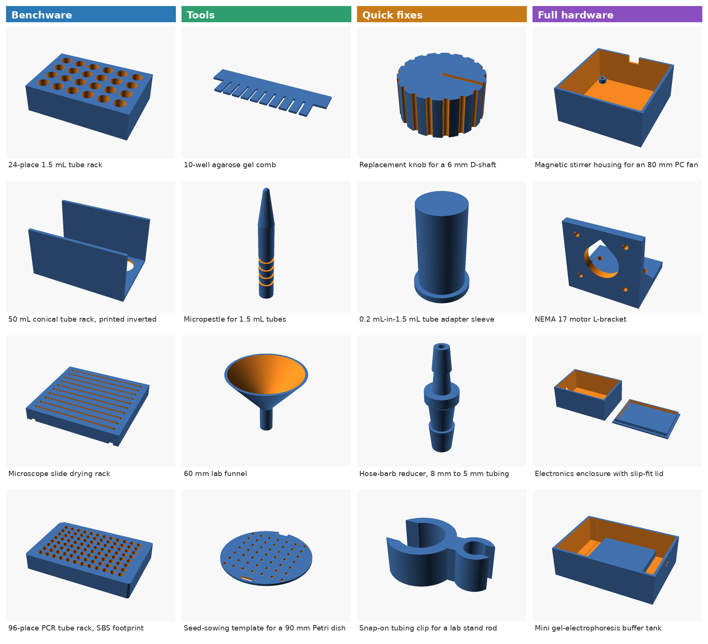
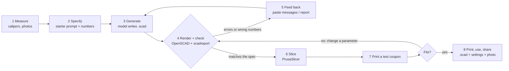
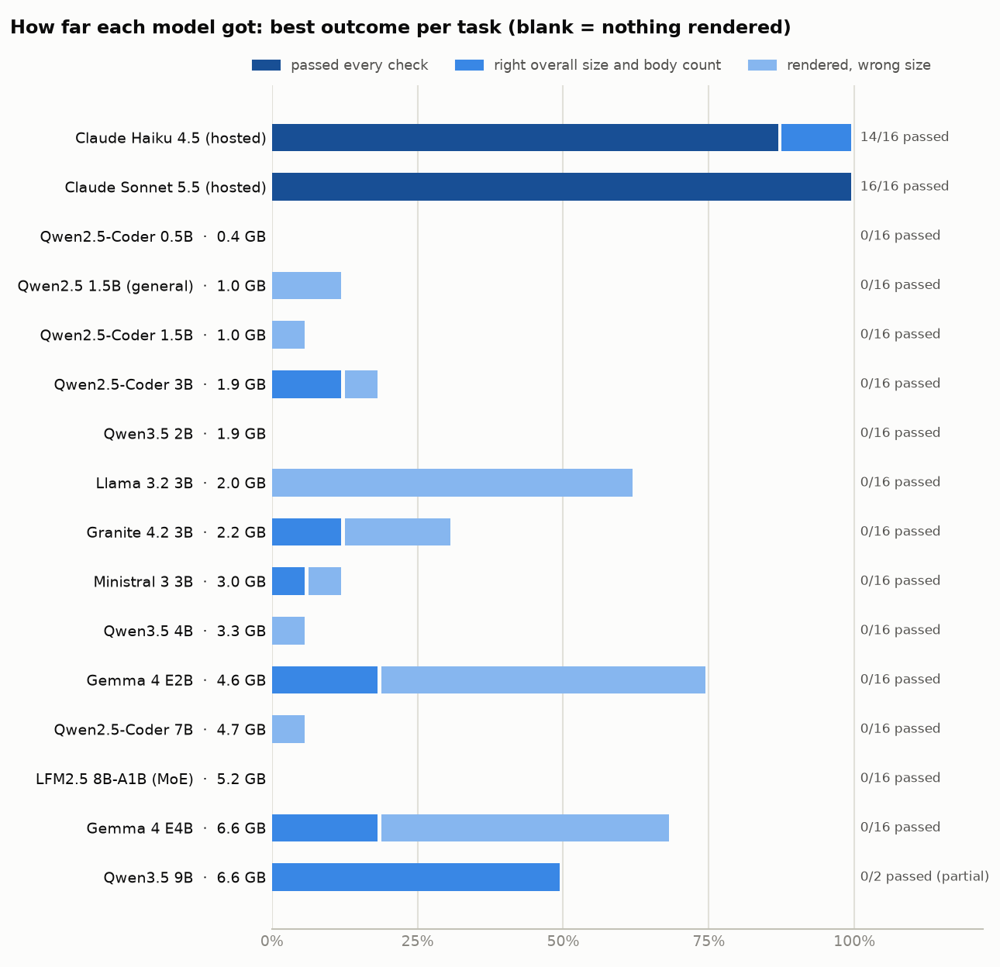
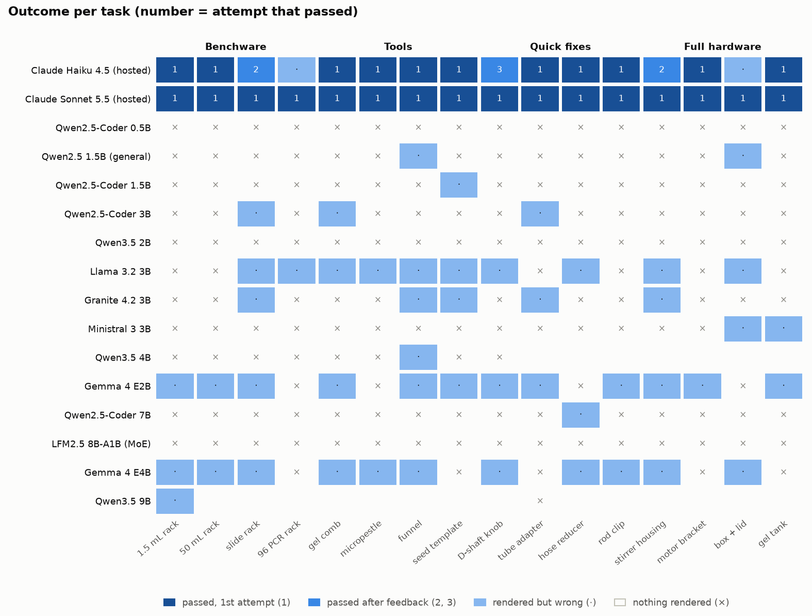
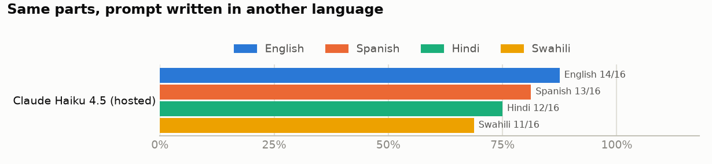

# Prompt to Bench: language models as a no-CAD entry point to 3D printing for biology labs

[](https://doi.org/10.5281/zenodo.23198097)

**Sebastian S. Cocioba** ([ORCID 0000-0002-6821-2996](https://orcid.org/0000-0002-6821-2996); [@ATinyGreenCell](https://github.com/ATinyGreenCell)), Binomica Labs, and contributors

*Living preprint, v0.2 draft (6 October 2026). This README **is** the paper. Corrections, tasks, designs, models and languages are welcome; see [How to contribute](#how-to-contribute). How it was built, prompt by prompt, is in the [build log](meta/BUILD_LOG.md).*

> **In this repository:** the paper (this page) · [student tutorial](tutorial/README.md) and [setup guide](tutorial/SETUP.md) · [16 parametric OpenSCAD lab designs](designs/) · [the Prompt-to-Bench benchmark](bench/) · [`scadreport`](tools/scadreport.py), a geometry-feedback tool for any chatbot · [audits](meta/audits/) · licences: text CC BY 4.0, designs CERN-OHL-P-2.0, code MIT.

---

## Abstract

Biology labs run on small plastic parts: tube racks, gel combs, adapters, knobs, brackets and housings. A desktop 3D printer makes them for cents, but designing them has required CAD skills most biologists never learn. Language models lower that barrier when the CAD is written as code: the user describes a part in words and measured numbers, the model writes an OpenSCAD program, and the user renders, checks and prints it. We describe this workflow and the practices that make it reliable for people without CAD training, and release 16 parametric, geometry-checked designs across four kinds of lab prints (benchware, tools, quick fixes and parts of instruments; 32.8 h and about US$12 of PLA on a Prusa MK4), a benchmark that scores model-written OpenSCAD against hidden geometric checks, and a tool that measures the part a model actually built. Two hosted models passed nearly every task: Claude Sonnet 5.5 16 of 16 on the first try, Claude Haiku 4.5 14 of 16 within three attempts. None of the open-weight models (0.4-6.6 GB) we ran offline on a 2022 laptop CPU passed a task (two of fourteen runs are still being completed): the code models mostly wrote syntax OpenSCAD cannot parse and repeated the same file after feedback, and the reasoning models ran out of tokens. The best small models (Gemma 4 E2B and E4B) rendered most parts but rarely got their dimensions right. With this protocol, no open-weight model small enough for a typical student laptop is yet a usable design assistant; the workflow itself, and its feedback tools, already are.

---

## 1. Introduction

Every biology lab depends on a long tail of small, specific objects: a rack for the tubes this lab actually uses, a comb for a home-made gel tray, an adapter between two consumables, a replacement for the knob that cracked. Commercial versions are expensive, slow to arrive or not made at all. A decade of "open labware" has shown that printed and open-source equipment can match commercial tools at a fraction of the cost ([Pearce 2012](#pearce2012); [Baden et al. 2015](#baden2015); [Coakley & Hurt 2016](#coakley2016); [Pearce 2020](#pearce2020)), and that it matters most where budgets and supply chains are thinnest ([Maia Chagas 2018](#maiachagas2018); [Wenzel 2023](#wenzel2023)). In one collection of 26 printable lab items, which this author co-wrote, printed versions cost on average 8.18% of their commercial equivalents ([McNair et al. 2024](#mcnair2024)).

The printer is no longer the bottleneck; design is. Among scripting tools for parametric open labware, the most widely used is **OpenSCAD** ([OpenSCAD developers](#openscad); [Machado et al. 2019](#machado2019)), in which a part is a short program of solids, Boolean operations and loops. It underlies the OpenFlexure microscope ([Collins et al. 2020](#collins2020)), the FlyPi ([Maia Chagas et al. 2017](#maiachagas2017)), a syringe-pump library ([Wijnen et al. 2014](#wijnen2014)), printable optics ([Zhang et al. 2013](#zhang2013)) and a steady stream of recent biology tools ([Subbaraman et al. 2024](#subbaraman2024); [Keene-Snickers et al. 2025](#keenesnickers2025); [Yamazaki et al. 2025](#yamazaki2025); [Bhupathi et al. 2026](#bhupathi2026); [Algarín et al. 2026](#algarin2026)). Its users find spatial reasoning, validation and debugging the hard parts ([Gonzalez Avila et al. 2024](#gonzalezavila2024)).

Because OpenSCAD designs are text, a language model can draft them from a plain-language description. GPT-4 has been used this way for microfluidic components ([Nelson et al. 2023](#nelson2023)), benchmarks of frontier models find OpenSCAD among the most reliable code-CAD formats ([Jones et al. 2025](#jones2025); [Yang et al. 2026](#yang2026)), and OpenSCAD's developers are building an experimental assistant that talks to a local model by default ([OpenSCAD GSoC 2026](#openscadai2026)). In our lab, a hosted frontier model (Claude) and OpenSCAD now take routine parts from idea to a print-ready file in minutes, which is what prompted this paper.

Access to that combination is uneven. In 2025, 2.2 billion people were offline, and fixed broadband cost more than a quarter of average income in low-income countries ([ITU 2025](#itu2025)). Generative-AI use reached 24.7% of people in the Global North and 14.1% in the Global South ([Microsoft AI Economy Institute 2026](#microsoft2026)). Hosted models cost money, are not offered everywhere ([Anthropic, n.d.](#anthropicregions)), charge more per word for many non-English languages ([Ahia et al. 2023](#ahia2023)) and can change availability at short notice ([Anthropic 2026](#anthropic2026)); non-native English speakers already pay heavily to do science in English ([Amano et al. 2023](#amano2023)). **Open-weight** models running offline on a student's laptop could close much of this gap, but there are reasons for doubt: OpenSCAD is a very low-resource programming language ([§5.5](#55-what-to-expect-from-open-models)), and open-weight models, even at 8-70B parameters, have done poorly at CAD code without fine-tuning ([Badagabettu et al. 2024](#badagabettu2024); [Alrashedy et al. 2025](#alrashedy2025); [Dong et al. 2026](#dong2026)).

We ask three practical questions:

1. **Workflow.** What process, prompts and checks let someone without CAD training get a correct, printable lab part from a language model?
2. **Model size.** What is the smallest open-weight model that is useful for this, offline, on an ordinary laptop?
3. **Language.** Does writing the request in Spanish, Hindi or Swahili change the outcome? (We could test this only for one hosted model.)

**Contributions.**

- A workflow and best-practice rules, with a copy-paste starter prompt ([§3](#3-the-workflow), [§4](#4-best-practices)).
- 16 parametric OpenSCAD lab designs in four categories ([§2](#2-what-labs-print-four-kinds-of-parts), [`designs/`](designs/)).
- `scadreport`, a tool that reports what an OpenSCAD file actually builds - size, holes, spacing, overhangs - in text any chatbot can read ([`tools/`](tools/)).
- **Prompt-to-Bench-16**, 16 design requests with hidden, symmetry-aware geometric checks ([§5](#5-benchmark-prompt-to-bench-16)).
- An evaluation of 14 open-weight models running CPU-only and offline, with two hosted Claude models as a reference and a language ablation ([§6](#6-results)).
- A student tutorial ([`tutorial/`](tutorial/README.md)) and a public log of how this repository was built with an AI assistant ([`meta/`](meta/)).

## 2. What labs print: four kinds of parts

| Kind | Examples | What must be right | Typical risk |
|---|---|---|---|
| **Benchware** (holds, organises, stores) | tube and slide racks, plate-format holders, pipette stands | hole counts, spacing, standard footprints (e.g. ANSI/SLAS microplate) | low - wrong sizes waste plastic |
| **Tools** (used in a protocol) | gel combs, micropestles, funnels, sowing templates | key dimensions, surface finish, materials | low-moderate - contamination, chemical attack |
| **Quick fixes** (replace or adapt a part) | knobs, tube adapters, hose barbs, clips | a precise fit to an existing object | moderate - fit and load |
| **Full hardware** (parts of instruments) | stirrer housings, motor brackets, enclosures, gel tanks | interfaces, fasteners, assembly, electronics | higher - mechanical, electrical, biosafety ([§8](#8-safety-and-responsibility)) |

Our 16 designs cover all four kinds (Figure 1). Each is one OpenSCAD file with every dimension as a named parameter in [Customizer](https://files.openscad.org/documentation/manual/Customizer.html) sections, modelled in print orientation, with print, fit and safety notes in its header. All print without supports except where a hole's crown bridges (the motor bracket). Sliced with PrusaSlicer ([Prusa Research](#prusaslicer)) for an Original Prusa MK4 with the stock 0.20 mm profile, the set takes 32.8 h and 496 g of PLA, about US$12 (Table 1).

The library has two versions on purpose. The benchmark's answer keys are frozen in [`bench/reference/`](bench/reference/): each is exactly what its prompt asks for. The files in [`designs/`](designs/) are their lab-ready successors, revised after an independent mechanical and biological audit ([`meta/audits/`](meta/audits/)): wider clearances for tubes, slots that drain, standoffs so stirrer magnets clear the plate, a gel tank whose electrodes sit under the buffer, and explicit warnings where a part could be misused (for example, never spin the tube adapter in a centrifuge). The designs are geometry-checked and sliced; physical print-and-fit validation is in progress.

<p align="center"></p>

**Figure 1.** The 16 lab-ready designs in [`designs/`](designs/).

<details>
<summary><b>Table 1.</b> Print-time and filament estimates, Original Prusa MK4 (click to expand)</summary>

<!-- AUTO:table-prints -->
| Part | Kind | Print time | PLA (g) | Material cost (US$) |
|---|---|---:|---:|---:|
| 24-place 1.5 mL tube rack | Benchware | 5h 26m 54s | 78.7 | 1.97 |
| 50 mL conical tube rack, printed inverted | Benchware | 4h 9m 34s | 69.0 | 1.73 |
| Microscope slide drying rack | Benchware | 2h 2m 36s | 33.3 | 0.83 |
| 96-place PCR tube rack, SBS footprint | Benchware | 8h 8m 41s | 92.9 | 2.32 |
| 10-well agarose gel comb | Tools | 11m 32s | 2.7 | 0.07 |
| Micropestle for 1.5 mL tubes | Tools | 26m 34s | 1.9 | 0.05 |
| 60 mm lab funnel | Tools | 37m 36s | 9.3 | 0.23 |
| Seed-sowing template for a 90 mm Petri dish | Tools | 50m 45s | 12.0 | 0.30 |
| Replacement knob for a 6 mm D-shaft | Quick fixes | 21m 7s | 5.0 | 0.12 |
| 0.2 mL-in-1.5 mL tube adapter sleeve | Quick fixes | 10m 41s | 1.5 | 0.04 |
| Hose-barb reducer, 8 mm to 5 mm tubing | Quick fixes | 18m 39s | 1.7 | 0.04 |
| Snap-on tubing clip for a lab stand rod | Quick fixes | 7m 14s | 1.6 | 0.04 |
| Magnetic stirrer housing for an 80 mm PC fan | Full hardware | 3h 7m 49s | 53.9 | 1.35 |
| NEMA 17 motor L-bracket | Full hardware | 59m 51s | 14.2 | 0.35 |
| Electronics enclosure with push-fit lid | Full hardware | 1h 40m 19s | 33.9 | 0.85 |
| Mini gel-electrophoresis buffer tank | Full hardware | 4h 18m 32s | 84.4 | 2.11 |
| **All 16 parts** | | **32.8 h** | **496** | **12.40** |
<!-- /AUTO:table-prints -->

PrusaSlicer 2.9.6, stock "0.20mm SPEED @MK4 0.4" profile and "Prusament PLA @PG" for every part - not the finer per-part settings some headers recommend, which take longer. Mass assumes 1.24 g/cm³; cost assumes US$25/kg. Reproduce with `python tools/slice_library.py`.
</details>

## 3. The workflow



**Figure 2.** The model does the CAD; the person measures, checks and decides. Steps 4-5 can be run by an agent such as Claude Code or by hand with any chatbot.

Two features of the loop matter more than the choice of model.

**The specification carries the knowledge.** The user gives measured numbers, the print orientation and the coordinate frame ("the base lies on the bed at z = 0"). The model is never asked to remember a tube diameter or a fan's hole pattern; even standard dimensions - ANSI/SLAS microplate footprints, 80 mm fan holes, NEMA 17 bolt patterns - go into the request ([ANSI/SLAS 2004](#slas2004); [SUNON](#sunon); [Oriental Motor](#orientalmotor)).

**The model must be shown what it built.** A language model cannot see its part. When OpenSCAD fails, its messages go back to the model. When the file renders but the part is wrong, the useful feedback is a measurement, not "it's wrong". `scadreport` renders the file and reports whether it is one watertight solid, its bounding box, volume, bed contact and overhangs, and horizontal slices at up to ten representative heights - each listing every hole's shape, size and grid spacing. For a rack whose pitch and hole depth came out wrong:

```
BOUNDING BOX: X -53.00 .. 53.00 (size 106.00) | Y -36.00 .. 36.00 (size 72.00) | Z 0.00 .. 30.00 (size 30.00) mm
  z=1.50: 1 solid region [...]; 24 holes: 24 x circle d=11.19 [6 x 4 grid (X x Y), pitch X 15.00 / Y 15.00, ...]
  z=15.00: 1 solid region [...]; 24 holes: 24 x circle d=11.19 [6 x 4 grid (X x Y), pitch X 15.00 / Y 15.00, ...]
```

Compared with the request, two errors are visible: the pitch is 15 mm, not 16, and the holes reach z = 1.5, so the 5 mm floor is missing. The report knows nothing about the request, so it works for any part.

## 4. Best practices

These rules come from our own use of the workflow, the benchmark and the literature, and complement general guides to 3D printing in chemistry and biology labs ([Pamidi et al. 2024](#pamidi2024); [Saggiomo 2022](#saggiomo2022)).

1. **Measure; don't rely on memory - yours or the model's.** Give caliper numbers for everything that must fit.
2. **State the print orientation and the frame.** Say which face is on the bed at z = 0 and which way is +X. Many "wrong" parts are right shapes, upside down or in the wrong place.
3. **Use a starter prompt.** It fixes the style: millimetres, named parameters, built-in OpenSCAD only, cutters that overshoot faces, `$fn` for round holes, loops for arrays ([`bench/prompts/system.md`](bench/prompts/system.md)). Best-practice lists in the prompt also helped GPT-4 in earlier CAD work ([Makatura et al. 2023](#makatura2023)).
4. **Once a design works, change its numbers - don't regenerate it.** The `.scad` file becomes a template for the next lab.
5. **Check every part against the request.** Paste OpenSCAD's messages or a `scadreport` back into the chat when something is wrong.
6. **Print a coupon first.** A 2-3 mm slice with the critical holes takes minutes. FDM holes print undersized ([Slic3r manual](#slic3r)): start at about 0.3-0.5 mm clearance per side for parts that should drop in (tubes in racks), 0.2-0.3 mm for sliding fits, and calibrate for your printer and material: accuracy depends on speed, temperature and layer height ([Prusa Research, n.d.](#prusamodeling); [Popescu et al. 2023](#popescu2023); [Li et al. 2025](#li2025)).
7. **Design for the printer.** A flat face on the bed, overhangs under about 45°, no long bridges, walls of at least two extrusion widths. Print upside down when that removes supports; four of our designs (the 50 mL rack, the tube adapter, the enclosure lid and the stirrer housing) are modelled that way.
8. **Choose material for the lab.** PLA softens around 55-60 °C: no autoclaves, hot baths or heat blocks. Printed PETG, PP and PC also deformed in 121 °C autoclave tests ([Pérez Davila et al. 2021](#perezdavila2021); [Rynio et al. 2022](#rynio2022); [Popescu et al. 2025](#popescu2025)); PETG's heat deflection temperature is 68 °C ([Prusament TDS](#prusament)). Let agarose cool to 50-60 °C before it meets a printed comb. Brief wipes with 70% ethanol, isopropanol or dilute hypochlorite are fine on PLA ([Vaňková et al. 2020](#vankova2020)); long soaks weaken parts ([Kaptan 2025](#kaptan2025)), and PETG is attacked by acetone, phenol and chloroform.
9. **Know what not to print.** No rotors or adapters for commercial centrifuges ([Eppendorf](#eppendorf)), pressure vessels, mains-powered enclosures without proper electrical design ([IEC 61010-1](#iec61010)), or anything that touches patients ([§8](#8-safety-and-responsibility)).
10. **Share the source, not just the STL.** The `.scad` file is the source of open hardware ([Bonvoisin et al. 2017](#bonvoisin2017); [Diederich et al. 2022](#diederich2022)). Add print settings, a photo, and the model and prompt that produced it.
11. **Keep private work local.** Do not paste unpublished or client designs into hosted services you do not control.
12. **Pick the model for the job.** In our tests only the hosted models produced correct parts. Small open-weight models are worth trying offline, but check everything they produce, and expect to fix the code yourself ([§6](#6-results)).

## 5. Benchmark: Prompt-to-Bench-16

### 5.1 Tasks

Each task is a request as a careful student would write it after measuring: dimensions in millimetres, the print orientation, the frame where it matters, and plain-language features. There are four tasks per category (Table 2), covering blind and through holes, 1-D and 2-D arrays (up to 96 holes in the ANSI/SLAS footprint), slots, teeth, revolved profiles, polar arrays, D-shaped bores, open rings, horizontal holes, multi-part layouts and a clearance fit. Prompts and checks are in [`bench/tasks.yaml`](bench/tasks.yaml); the frozen answer keys are in [`bench/reference/`](bench/reference/).

| Category | Task | What it exercises |
|---|---|---|
| Benchware | 24-place 1.5 mL tube rack | block, blind holes, 6 x 4 grid |
| Benchware | 50 mL conical tube rack, printed inverted | print orientation, through holes, walls |
| Benchware | Microscope slide drying rack | ten 1.6 mm slots |
| Benchware | 96-place PCR tube rack, SBS footprint | standard footprint, 96-hole grid, orientation chamfer |
| Tools | 10-well agarose gel comb | flat 2-D profile, tooth array |
| Tools | Micropestle for 1.5 mL tubes | stacked primitives, cone, grooves at given heights |
| Tools | 60 mm lab funnel | hollow solid of revolution, open ends |
| Tools | Seed-sowing template for a 90 mm Petri dish | disc, 49-hole grid, orientation notch |
| Quick fixes | Replacement knob for a 6 mm D-shaft | D-shaped bore, 18-groove polar array, aligned pointer |
| Quick fixes | 0.2 mL-in-1.5 mL tube adapter sleeve | concentric cylinders, upside-down printing |
| Quick fixes | Hose-barb reducer, 8 mm to 5 mm tubing | revolved sawtooth profile, through bore |
| Quick fixes | Snap-on tubing clip for a lab stand rod | 2-D Booleans, open rings, explicit coordinates |
| Full hardware | Magnetic stirrer housing for an 80 mm PC fan | shelled box, bolt pattern, cable notch |
| Full hardware | NEMA 17 motor L-bracket | horizontal holes, bolt patterns, gussets |
| Full hardware | Electronics enclosure with slip-fit lid | two bodies, 0.2 mm clearance |
| Full hardware | Mini gel-electrophoresis buffer tank | internal platform, chambers, holes |

**Table 2.** The 16 tasks. They test whether a model follows a specification; the lab-ready parts in [`designs/`](designs/) differ where real use called for it ([§2](#2-what-labs-print-four-kinds-of-parts)).

### 5.2 Hidden geometric checks

The model never sees the checks. A candidate is rendered with OpenSCAD's Manifold kernel ([Lalish et al.](#manifold)), normalised (bounding-box centre at the origin in XY, lowest point at z = 0) and tested with:

- **global checks:** bounding box, number of bodies, watertightness, volume relative to the reference;
- **horizontal sections:** number of solid regions and holes, hole sizes, positions and grids, section areas;
- **probe points** that must be solid or empty (notches, chamfers, horizontal holes);
- **line and arc probes** that count solid intervals (comb teeth, grip grooves).

Position-dependent checks are evaluated under all eight symmetries of the bed (90° rotations and mirroring), which do not change how a part prints, and the best match is kept. A part passes only if every check passes. Absolute tolerances are 0.15-0.9 mm (most 0.3-0.5 mm, tighter for the 0.2 mm clearance fit, looser where the prompt allows two readings), plus 4-35% on areas and volumes; they are set to accept every correct reading of the prompt, not to mimic print accuracy.

[`bench/build_refs.py`](bench/build_refs.py) confirms that the references pass their own checks, still pass after rotation, mirroring and translation, fail when scaled by 3%, and pass no other task's checks. These tests show the checks are self-consistent, not that every correct design passes. An audit found one false negative: "a 1.6 mm wall everywhere" on the funnel can be measured horizontally (our reference) or perpendicular to the cone (+24% volume); we widened that task's volume tolerance and re-checked every saved attempt with [`bench/rescore.py`](bench/rescore.py), which changed that one verdict and no other. Building the checks also caught an error in our own design: a 7 x 7 grid at 10 mm pitch put the corner holes through the rim of the 85 mm seed template.

### 5.3 Protocol

- **Prompt:** the same system prompt ([`bench/prompts/system.md`](bench/prompts/system.md)) for every model, then the task text.
- **Code extraction:** the longest OpenSCAD-labelled fenced block (otherwise any fenced block, the text after an unclosed fence, or the whole reply if it contains OpenSCAD calls). Local replies stop once a complete block has arrived, so in practice their first block counts.
- **Feedback:** a part that fails gets one message and another try, up to three attempts: OpenSCAD's own errors when nothing rendered, otherwise the `scadreport` measurement with an instruction to compare it with the specification. The hidden checks are never shown, but they decide *whether* feedback is sent, so "passed within three attempts" is an optimistic bound on what a user who must spot errors alone would get.
- **Local models:** Ollama 0.30.11, 4-bit weights (Q4_K_M), temperature 0.2, top-p 0.95, a fixed seed per attempt, 8,192-token context, "thinking" requested off where a model supports the switch. Replies end at 2,048 tokens, when a complete OpenSCAD block has arrived, or when the model repeats itself verbatim. Qwen2.5-Coder 3B and 7B ran with an earlier 1,024-token cap that never applied (their longest reply was 723 tokens); we raised the cap after a first pass cut off Gemma 4 E4B and others, and reran those models.
- **Hosted reference:** Claude Haiku 4.5 and Claude Sonnet 5.5 through the Claude Code command line in print mode, with our system prompt, tools disabled and otherwise vendor defaults: the API's default temperature (the CLI cannot set it) and no seed. Haiku used extended thinking (median about 10,000 output tokens per reply, range 4,100-23,500); Sonnet answered directly (320-1,430 tokens, 4-12 s per reply). This is Claude at its defaults, not an equal-cost comparison.
- **Hardware:** a 2022 laptop, Intel Core i7-1260P (12 cores, 16 threads), 16 GB RAM, no discrete GPU, Ubuntu, OpenSCAD 2026.10.01 (development snapshot), PrusaSlicer 2.9.6. Local models ran one at a time, but some runs overlapped other work on the same laptop (for example the hosted language run, whose rendering uses the CPU), so timings are indicative (roughly ±20%), not clean benchmarks.

### 5.4 Models

<!-- AUTO:table-models -->
| Model | Family | Parameters | Download | Licence |
|---|---|---|---:|---|
| Qwen2.5-Coder 0.5B (`qwen2.5-coder:0.5b`) | Qwen2.5-Coder | 0.49B | 0.4 GB | Apache-2.0 |
| Qwen2.5-Coder 1.5B (`qwen2.5-coder:1.5b`) | Qwen2.5-Coder | 1.54B | 0.99 GB | Apache-2.0 |
| Qwen2.5 1.5B (general) (`qwen2.5:1.5b`) | Qwen2.5 | 1.54B | 0.99 GB | Apache-2.0 |
| Qwen3.5 2B (`qwen3.5:2b-q4_K_M`) | Qwen3.5 | 2.27B | 1.9 GB | Apache-2.0 |
| Qwen2.5-Coder 3B (`qwen2.5-coder:3b`) | Qwen2.5-Coder | 3.09B | 1.9 GB | Qwen Research (non-commercial) |
| Llama 3.2 3B (`llama3.2:3b`) | Llama 3.2 | 3.21B | 2 GB | Llama 3.2 Community |
| Granite 4.2 3B (`granite4.2:3b`) | Granite 4.2 | 3B | 2.2 GB | Apache-2.0 |
| Ministral 3 3B (`ministral-3:3b`) | Ministral 3 | 3.4B | 3 GB | Apache-2.0 |
| Qwen3.5 4B (`qwen3.5:4b-q4_K_M`) | Qwen3.5 | 4.66B | 3.3 GB | Apache-2.0 |
| Gemma 4 E2B (`gemma4:e2b-it-q4_K_M`) | Gemma 4 | 2.3B effective, 5.1B with per-layer embeddings | 4.6 GB | Apache-2.0 |
| Qwen2.5-Coder 7B (`qwen2.5-coder:7b`) | Qwen2.5-Coder | 7.61B | 4.7 GB | Apache-2.0 |
| LFM2.5 8B-A1B (MoE) (`lfm2.5:8b-a1b-q4_K_M`) | LFM2.5 | 8.3B total, ~1.5B active per token | 5.2 GB | LFM Open v1.0 (revenue cap) |
| Gemma 4 E4B (`gemma4:e4b-it-q4_K_M`) | Gemma 4 | 4.5B effective, 8B with per-layer embeddings | 6.6 GB | Apache-2.0 |
| Qwen3.5 9B (`qwen3.5:9b-q4_K_M`) | Qwen3.5 | 9.65B | 6.6 GB | Apache-2.0 |
| Claude Haiku 4.5 (hosted) (`claude:claude-haiku-4-5`) | Claude | - | hosted | proprietary API |
| Claude Sonnet 5.5 (hosted) (`claude:claude-sonnet-5-5`) | Claude | - | hosted | proprietary API |
<!-- /AUTO:table-models -->

The 14 local models come from eight families: Qwen2.5-Coder ([Hui et al. 2024](#hui2024)), Qwen2.5 ([Qwen Team 2024](#qwen2024)), Qwen3.5 ([Qwen Team 2026](#qwen2026)), Gemma 4 ([Gemma Team 2026](#gemma2026)), Ministral 3 ([Liu et al. 2026](#liu2026)), Granite 4.2 ([IBM Granite Team 2026](#ibm2026)), LFM2.5 ([Liquid AI 2026](#liquid2026)) and Llama 3.2 ([Meta 2024](#meta2024)), all run through Ollama ([Ollama](#ollama)) on llama.cpp ([Gerganov et al.](#llamacpp)) as 4-bit GGUF files ([Kawrakow 2023](#kawrakow2023)). Sizes are Ollama download sizes; parameter counts and licences are from the model cards (accessed 5 October 2026). "Open-weight" is not open source, and licences matter for labs that sell services: the Qwen2.5-Coder 3B weights are non-commercial, LFM2.5 has a revenue threshold, and Llama 3.2 has its own licence ([Qwen 2024](#qwen3blicense); [Liquid AI 2026](#liquid2026); [Meta 2024](#meta2024)). Tags and digests are in [`bench/logs/model_digests.txt`](bench/logs/model_digests.txt).

### 5.5 What to expect from open models

**OpenSCAD is a low-resource language.** In The Stack, an openly licensed corpus used to pretrain many code models, OpenSCAD is about 0.03 GB of compressed data, against about 47 GB for Python and 1.6 GB for Lua ([Kocetkov et al. 2022](#kocetkov2022); [Lozhkov et al. 2024](#lozhkov2024)) - and Lua is itself the usual example of a "low-resource" language ([Cassano et al. 2024](#cassano2024)). Quantised 7B code models on a CPU-only laptop score below 50% on Lua benchmarks ([Nyamsuren 2025](#nyamsuren2025)).

**Open models have done poorly at CAD code without fine-tuning.** CodeLlama-70B produced "extremely bad" FreeCAD output ([Badagabettu et al. 2024](#badagabettu2024)); open models compiled less often than GPT-4 ([Alrashedy et al. 2025](#alrashedy2025)); on a 2026 assembly benchmark, open-weight models of 8B parameters and up scored about 3-4% against about 20% for the best closed models ([Dong et al. 2026](#dong2026)). Small-model successes come from fine-tuning on narrow CAD datasets ([Rukhovich et al. 2025](#rukhovich2025); [Govindarajan et al. 2026](#govindarajan2026); [Xie & Ju 2025](#xie2025)). We test models as a student would download them.

**"Minimal viable", defined before analysing local results.** A minimally viable local model passes at least **half of the 16 tasks within three attempts**, runs on a 16 GB laptop without a GPU, and needs a median of at most **10 minutes per task**; the minimal one is the smallest download that meets all three.

## 6. Results

### 6.1 Overall

<!-- AUTO:table-main -->
| Model | Download | Licence | Pass, 1st try | Pass, ≤3 tries (95% CI) | Renders 1st try | Median min/task | Tokens/s | Same code after feedback |
|---|---:|---|---:|---:|---:|---:|---:|---:|
| Claude Haiku 4.5 (hosted) | hosted | proprietary API | 11/16 | 14/16 (64-97%) | 15/16 | 1.9 | - | 2/8 |
| Claude Sonnet 5.5 (hosted) | hosted | proprietary API | 16/16 | 16/16 (81-100%) | 16/16 | 0.1 | - | 0/1 |
| Qwen2.5-Coder 0.5B | 0.4 GB | Apache-2.0 | 0/16 | 0/16 (0-19%) | 0/16 | 0.8 | 37.7 | 24/32 |
| Qwen2.5 1.5B (general) | 0.99 GB | Apache-2.0 | 0/16 | 0/16 (0-19%) | 2/16 | 1.0 | 22.0 | 27/32 |
| Qwen2.5-Coder 1.5B | 0.99 GB | Apache-2.0 | 0/16 | 0/16 (0-19%) | 1/16 | 1.4 | 12.8 | 32/32 |
| Qwen2.5-Coder 3B | 1.9 GB | Qwen Research (non-commercial) | 0/16 | 0/16 (0-19%) | 3/16 | 1.9 | 10.7 | 31/32 |
| Qwen3.5 2B | 1.9 GB | Apache-2.0 | 0/16 | 0/16 (0-19%) | 0/16 | 6.3 | 18.4 | 0/32 |
| Llama 3.2 3B | 2.0 GB | Llama 3.2 Community | 0/16 | 0/16 (0-19%) | 8/16 | 2.2 | 10.3 | 6/32 |
| Granite 4.2 3B | 2.2 GB | Apache-2.0 | 0/16 | 0/16 (0-19%) | 2/16 | 14.8 | 6.9 | 0/32 |
| Ministral 3 3B | 3.0 GB | Apache-2.0 | 0/16 | 0/16 (0-19%) | 1/16 | 3.6 | 9.0 | 0/32 |
| Qwen3.5 4B *(partial)* | 3.3 GB | Apache-2.0 | 0/9 | 0/9 (0-30%) | 1/9 | 15.2 | 8.5 | 0/18 |
| Gemma 4 E2B | 4.6 GB | Apache-2.0 | 0/16 | 0/16 (0-19%) | 12/16 | 3.6 | 18.6 | 3/32 |
| Qwen2.5-Coder 7B | 4.7 GB | Apache-2.0 | 0/16 | 0/16 (0-19%) | 1/16 | 3.1 | 5.8 | 32/32 |
| LFM2.5 8B-A1B (MoE) | 5.2 GB | LFM Open v1.0 (revenue cap) | 0/16 | 0/16 (0-19%) | 0/16 | 5.1 | 20.8 | 0/32 |
| Gemma 4 E4B | 6.6 GB | Apache-2.0 | 0/16 | 0/16 (0-19%) | 9/16 | 6.1 | 11.7 | 5/32 |
| Qwen3.5 9B *(partial)* | 6.6 GB | Apache-2.0 | 0/2 | 0/2 (0-66%) | 1/2 | 17.2 | 4.7 | 1/4 |
<!-- /AUTO:table-main -->

**Table 3.** Main results. "Renders 1st try" means the first file produced a non-empty solid, correct or not. Intervals are Wilson 95% intervals over the 16 tasks of a single run (over the tasks completed, for partial rows); they do not include run-to-run variation. "Same code after feedback" counts repair attempts that returned a byte-identical file.

The hosted models are at or near the ceiling. Claude Sonnet 5.5 passed all 16 tasks on the first try; Claude Haiku 4.5 passed 11 on the first try and 14 within three attempts, failing the 96-place rack (one chamfer probe) and the enclosure (a lid with a solid floor under its lip, +14% volume). With one run each, the two cannot be ranked (paired exact test on first tries, p = 0.06), and the benchmark cannot separate hosted models of this class.

No local model passed a task. Every complete local model scored 0 of 16 (Wilson upper bound 19%), so none met the viability bar in [§5.5](#55-what-to-expect-from-open-models). The Qwen3.5 4B and 9B runs are still being completed; their partial rows are marked.

### 6.2 How far the local models got

<!-- AUTO:fig-tiers -->
<picture>
  <source media="(prefers-color-scheme: dark)" srcset="figures/fig_tiers_dark.png">
  
</picture>
<!-- /AUTO:fig-tiers -->

**Figure 3.** The best outcome each model reached per task, from nothing rendered (blank) to a part with the right overall size and body count, to a pass. Local models are ordered by download size.

<!-- AUTO:table-graded -->
| Model | Rendered (any try) | Right size and body count | Passed | Tasks with ≥ half the checks | First file treats geometry as a value | Attempts cut off (cap or loop) | Same code after feedback |
|---|---:|---:|---:|---:|---:|---:|---:|
| Claude Haiku 4.5 (hosted) | 16/16 | 16/16 | 14/16 | 16/16 | 0/16 | 0/24 | 2/8 |
| Claude Sonnet 5.5 (hosted) | 16/16 | 16/16 | 16/16 | 16/16 | 0/16 | 0/17 | 0/1 |
| Qwen2.5-Coder 0.5B | 0/16 | 0/16 | 0/16 | 0/16 | 0/16 | 27/48 | 24/32 |
| Qwen2.5 1.5B (general) | 2/16 | 0/16 | 0/16 | 0/16 | 6/16 | 15/48 | 27/32 |
| Qwen2.5-Coder 1.5B | 1/16 | 0/16 | 0/16 | 0/16 | 14/16 | 3/48 | 32/32 |
| Qwen2.5-Coder 3B | 3/16 | 2/16 | 0/16 | 2/16 | 11/16 | 0/48 | 31/32 |
| Qwen3.5 2B | 0/16 | 0/16 | 0/16 | 0/16 | 3/16 | 42/48 | 0/32 |
| Llama 3.2 3B | 10/16 | 0/16 | 0/16 | 0/16 | 2/16 | 1/48 | 6/32 |
| Granite 4.2 3B | 5/16 | 2/16 | 0/16 | 1/16 | 8/16 | 37/48 | 0/32 |
| Ministral 3 3B | 2/16 | 1/16 | 0/16 | 1/16 | 8/16 | 1/48 | 0/32 |
| Qwen3.5 4B *(partial)* | 1/9 | 0/9 | 0/9 | 0/9 | 5/9 | 22/27 | 0/18 |
| Gemma 4 E2B | 12/16 | 3/16 | 0/16 | 6/16 | 2/16 | 1/48 | 3/32 |
| Qwen2.5-Coder 7B | 1/16 | 0/16 | 0/16 | 0/16 | 15/16 | 0/48 | 32/32 |
| LFM2.5 8B-A1B (MoE) | 0/16 | 0/16 | 0/16 | 0/16 | 2/16 | 41/48 | 0/32 |
| Gemma 4 E4B | 11/16 | 3/16 | 0/16 | 6/16 | 3/16 | 5/48 | 5/32 |
| Qwen3.5 9B *(partial)* | 1/2 | 1/2 | 0/2 | 1/2 | 0/2 | 1/6 | 1/4 |
<!-- /AUTO:table-graded -->

**Table 4.** Graded outcomes. "Right size and body count": the bounding box and number of separate solids match, on any attempt. "Geometry as a value": the first file assigns shapes to variables (`rack = cube(...)`), which OpenSCAD cannot parse. "Cut off": attempts that ended at the token cap or in a verbatim loop.

The zeros hide three different failures:

- **Code models write a different language.** Qwen2.5-Coder 1.5B, 3B and 7B wrote "geometry as a value" in 11-15 of 16 first files - OpenSCAD written as if it were Python or JavaScript - and almost never produced a part.
- **Feedback changed nothing for them.** The same three models returned byte-identical code in 31-32 of 32 repair attempts, even with a new random seed; Qwen2.5-Coder 0.5B and the general Qwen2.5 1.5B did so in 24 and 27 of 32. A bare "syntax error, line 18" from OpenSCAD did not tell them what to change.
- **Reasoning models ran out of words.** With thinking requested off, Qwen3.5 and Granite 4.2 reasoned inside code comments, and LFM2.5 ignored the switch and wrote `<think>` reasoning in every reply; 37-42 of their 48 attempts ended at the 2,048-token cap or in a loop. Their scores say as much about the protocol as about their design ability.

The closest were the Gemma 4 models (E2B and E4B), which rendered 11-12 of 16 parts and met half the checks on 6 tasks, but got the overall size right on only 3. The single best local attempt (Gemma 4 E4B, micropestle) failed one check: its grip grooves were 1.5 mm deep instead of 1 mm.

<!-- AUTO:fig-outcomes -->
<picture>
  <source media="(prefers-color-scheme: dark)" srcset="figures/fig_outcomes_dark.png">
  
</picture>
<!-- /AUTO:fig-outcomes -->

**Figure 4.** Outcome per model and task. Numbers give the attempt that passed; "·" rendered but never matched the specification; "×" nothing rendered.

<!-- AUTO:table-categories -->
| Model | Benchware | Tools | Quick fixes | Full hardware |
|---|---:|---:|---:|---:|
| Claude Haiku 4.5 (hosted) | 3/4 | 4/4 | 4/4 | 3/4 |
| Claude Sonnet 5.5 (hosted) | 4/4 | 4/4 | 4/4 | 4/4 |
| Qwen2.5-Coder 0.5B | 0/4 | 0/4 | 0/4 | 0/4 |
| Qwen2.5 1.5B (general) | 0/4 | 0/4 | 0/4 | 0/4 |
| Qwen2.5-Coder 1.5B | 0/4 | 0/4 | 0/4 | 0/4 |
| Qwen2.5-Coder 3B | 0/4 | 0/4 | 0/4 | 0/4 |
| Qwen3.5 2B | 0/4 | 0/4 | 0/4 | 0/4 |
| Llama 3.2 3B | 0/4 | 0/4 | 0/4 | 0/4 |
| Granite 4.2 3B | 0/4 | 0/4 | 0/4 | 0/4 |
| Ministral 3 3B | 0/4 | 0/4 | 0/4 | 0/4 |
| Qwen3.5 4B | 0/4 | 0/4 | 0/1 | - |
| Gemma 4 E2B | 0/4 | 0/4 | 0/4 | 0/4 |
| Qwen2.5-Coder 7B | 0/4 | 0/4 | 0/4 | 0/4 |
| LFM2.5 8B-A1B (MoE) | 0/4 | 0/4 | 0/4 | 0/4 |
| Gemma 4 E4B | 0/4 | 0/4 | 0/4 | 0/4 |
| Qwen3.5 9B | 0/1 | - | 0/1 | - |
<!-- /AUTO:table-categories -->

**Table 5.** Tasks passed within three attempts, by category (out of 4).

<!-- AUTO:table-failures -->
| Model | truncated | no code | syntax error | render error | no solid | timeout | wrong geometry | pass |
|---|---:|---:|---:|---:|---:|---:|---:|---:|
| Claude Haiku 4.5 (hosted) | 0 | 0 | 1 | 0 | 0 | 0 | 4 | 11 |
| Claude Sonnet 5.5 (hosted) | 0 | 0 | 0 | 0 | 0 | 0 | 0 | 16 |
| Qwen2.5-Coder 0.5B | 9 | 0 | 7 | 0 | 0 | 0 | 0 | 0 |
| Qwen2.5 1.5B (general) | 5 | 0 | 9 | 0 | 0 | 0 | 2 | 0 |
| Qwen2.5-Coder 1.5B | 1 | 0 | 11 | 1 | 2 | 0 | 1 | 0 |
| Qwen2.5-Coder 3B | 0 | 0 | 12 | 0 | 1 | 0 | 3 | 0 |
| Qwen3.5 2B | 15 | 0 | 0 | 1 | 0 | 0 | 0 | 0 |
| Llama 3.2 3B | 1 | 0 | 5 | 1 | 1 | 0 | 8 | 0 |
| Granite 4.2 3B | 12 | 0 | 1 | 0 | 1 | 0 | 2 | 0 |
| Ministral 3 3B | 0 | 0 | 13 | 0 | 2 | 0 | 1 | 0 |
| Qwen3.5 4B | 8 | 0 | 0 | 0 | 0 | 0 | 1 | 0 |
| Gemma 4 E2B | 0 | 0 | 4 | 0 | 0 | 0 | 12 | 0 |
| Qwen2.5-Coder 7B | 0 | 0 | 15 | 0 | 0 | 0 | 1 | 0 |
| LFM2.5 8B-A1B (MoE) | 16 | 0 | 0 | 0 | 0 | 0 | 0 | 0 |
| Gemma 4 E4B | 3 | 0 | 3 | 1 | 0 | 0 | 9 | 0 |
| Qwen3.5 9B | 0 | 0 | 1 | 0 | 0 | 0 | 1 | 0 |
<!-- /AUTO:table-failures -->

**Table 6.** Where each model's first attempt stopped: cut off (token cap or loop), no code, a syntax or other render error, no solid (empty or 2-D), a rendered part with the wrong geometry, or a pass.

### 6.3 Language

<!-- AUTO:fig-languages -->
<picture>
  <source media="(prefers-color-scheme: dark)" srcset="figures/fig_languages_dark.png">
  
</picture>
<!-- /AUTO:fig-languages -->

With Claude Haiku 4.5, requests in Spanish, Hindi and Swahili (system prompt in English) passed 13, 12 and 11 of 16 tasks within three attempts, against 14 in English; first-try passes were 12, 10 and 6 against 11. With one sample per task at the default temperature, none of these differences is statistically detectable (paired exact McNemar tests, p ≥ 0.38 for passes, p = 0.13 for Swahili first tries), and the tasks that failed differed between languages, as sampling noise would produce. We did not run the language ablation on local models, which passed nothing in English. A bug overwrote the generated code of the Spanish and Hindi runs (their scores were recorded first), so those two runs cannot be re-checked; it is fixed for future runs.

## 7. Global access

**Cost.** A Prusa MK4S costs about US$650-1,000 (kit vs assembled) and capable budget printers about US$200 ([Prusa Research](#prusaprice); [Bambu Lab](#bambuprice); [Creality](#crealityprice)). After that, parts are cheap: our 16-part library uses about US$12 of PLA. OpenSCAD, PrusaSlicer, Ollama and open-weight models are free; hosted models need a subscription or per-token payment, often in a currency labs cannot easily use.

**Connectivity.** The local workflow runs offline once installed; the obstacle is the one-time download of the software plus 0.4-6.6 GB per model. In nine of ten low-income economies a 5 GB mobile data basket costs more than 10% of monthly income ([ITU 2025b](#itu2025b)), so teaching labs, maker spaces and networks such as TReND ([Baden et al. 2020](#baden2020)) or GOSH ([GOSH 2017](#gosh2017)) should share models on USB drives or local mirrors.

**Availability.** Major hosted providers exclude a small set of countries and territories, including China, Russia and Iran ([Anthropic, n.d.](#anthropicregions); [OpenAI, n.d.](#openairegions); [Google, n.d.](#googleregions)); most low-income countries are supported. Access can still change: in June 2026 a US government directive suspended two frontier Anthropic models for "any foreign national" for 18 days while other models stayed available ([Anthropic 2026](#anthropic2026)). A local model cannot be switched off this way, and it keeps unpublished designs on the user's machine.

**Language.** Language models perform worse in many non-English languages ([Ahuja et al. 2023](#ahuja2023)), and code generation degrades more steeply for small open models than for frontier ones as prompts move to lower-resource languages ([Raihan et al. 2025](#raihan2025)). Our one-model test found no detectable effect ([§6.3](#63-language)).

**Hardware.** The test machine is a mid-range 2022 ultrabook with 16 GB of RAM; the 6.6 GB models ran on it alongside a desktop session with an 8,192-token context. We did not test larger models.

**Where this leaves a student without a subscription.** Today, the reliable path still runs through a hosted model; free tiers of hosted chatbots may be enough for simple parts (we did not test them). The parts of the workflow that do not depend on the model - measuring, writing a precise request, checking with `scadreport`, printing coupons, editing parameters - transfer completely, and so does the design library.

## 8. Safety and responsibility

A model that writes plausible CAD does not know your lab, your materials or your risks.

- **Materials and sterilisation.**
  - Fresh FDM prints can be close to sterile off the nozzle ([Neches et al. 2016](#neches2016)), but handling ends that, and layer lines harbour biofilm ([Hall et al. 2021](#hall2021)). Ethanol disinfects but does not kill spores, so anything that touches media or cultures should be soaked, dried in a hood and treated as single use.
  - Printed PLA cannot be autoclaved ([Neijhoft et al. 2023](#neijhoft2023)), and printed PETG, PP and PC deformed at 121 °C in tests ([Rynio et al. 2022](#rynio2022); [Popescu et al. 2025](#popescu2025)); moulded PP labware is a different matter and is routinely autoclaved.
  - UV-C degrades PETG faster than PLA ([Amza et al. 2021](#amza2021)), and resin (SLA) prints can be toxic to sensitive organisms ([Macdonald et al. 2016](#macdonald2016)). Test printed materials in your own system before trusting them with cells or organisms.
- **Centrifuges.** Manufacturers require their own accessories ([Eppendorf](#eppendorf)), and biosafety guidance relies on certified sealed rotors or safety cups ([CDC & NIH 2020](#bmbl2020)). Our tube adapter fits a 1.5 mL rotor bore by design, so its header says, in capitals, never to spin it.
- **Electrical hardware.** Mains-powered devices fall under IEC 61010-1 ([IEC 2010](#iec61010)); keep DIY electronics at safe low voltage behind certified supplies. Gel electrophoresis runs at hazardous DC voltages: our tank does not include a lid or interlock, and its header says not to connect a power supply until one is built.
- **Printing.** Printers emit ultrafine particles and volatile organic compounds, more with ABS than with PLA ([Azimi et al. 2016](#azimi2016)); follow institutional ventilation guidance ([NIOSH 2020](#niosh2020)).
- **Distribution.** Open-hardware certification is not safety certification ([OSHWA 2026](#oshwa2026)). From 9 December 2026 the EU Product Liability Directive treats "digital manufacturing files" as products ([EU 2024](#eu2024)); anyone distributing printable designs commercially in the EU should take advice (this is not legal advice). Document hazards with each design, as hardware journals require ([HardwareX template](#hardwarex)).

## 9. Limitations

- **Scale.** Sixteen tasks, one run per model, one computer. Intervals are wide and do not include run-to-run variation.
- **Protocol choices decide some results.** Thinking was requested off and replies were capped at 2,048 tokens, so models that reason before answering (Qwen3.5, Granite 4.2, LFM2.5) were mostly cut off; with thinking on and a larger budget they might do better, at a large cost in CPU time. Local models ran at temperature 0.2, which made several repeat themselves exactly; Claude ran at its default temperature. Feedback was triggered by the hidden checks (an optimistic bound).
- **Who wrote the tasks.** The tasks, checks, reference designs and translations were drafted with Claude (Anthropic), which may favour Claude's phrasing; the hosted models are near ceiling, so the benchmark cannot rank them. Independent tasks would help.
- **The harness evolved during the study.** We fixed bugs and added robustness after the first runs; re-checking every saved attempt with the final checker changed one verdict (§5.2). Two language runs cannot be re-checked (§6.3).
- **Geometry is not function.** Passing means the part matches the request, not that it works; the designs have not yet been printed and measured systematically.
- **Best-case prompts.** Our requests are complete and precise; real ones are vaguer.
- **Translations** have not yet been reviewed by native speakers.
- **Snapshot.** These results describe models available on 5 October 2026.

## 10. Conclusion

A language model plus OpenSCAD is already a practical way for a biologist without CAD training to make lab parts - when the model is a hosted frontier model, the request carries measured numbers and the print orientation, and every part is checked before it is printed. Under our protocol, no open-weight model small enough for a typical student laptop was yet a usable design assistant: the code models write OpenSCAD as if it were another language and do not use error messages, and the reasoning models run out of tokens before they finish. The gap is specific enough to close - examples of correct OpenSCAD in the prompt, error messages translated into instructions, thinking budgets that fit a laptop, or small models fine-tuned on code like the designs released here - and the benchmark is cheap to rerun on new models, hardware and languages. We hope others will.

---

## How to contribute

This is a living paper; contributions are credited and substantial ones earn authorship ([CONTRIBUTING.md](CONTRIBUTING.md)). Most useful:

- **Run the benchmark on your hardware** (`bench/run_bench.py`), especially in low-resource settings, and send the `results/` folder in a pull request.
- **Add a model** (one line in [`bench/models.yaml`](bench/models.yaml) plus a run) or **a task** from your lab ([`bench/tasks.yaml`](bench/tasks.yaml), validated with `python bench/build_refs.py`).
- **Review or add a language** in [`bench/prompts/translations.yaml`](bench/prompts/translations.yaml).
- **Print and measure** a design and report the fit with photos and caliper readings.
- **Translate the tutorial.**

## Reproducing this paper

```bash
python3 -m venv .venv && .venv/bin/pip install -r requirements.txt
.venv/bin/python bench/test_harness.py        # robustness tests (fake model, real OpenSCAD)
.venv/bin/python bench/build_refs.py          # validate the checker against the frozen references
bash bench/run_main_local.sh                  # local models via Ollama (hours on a CPU)
.venv/bin/python bench/analyze.py             # tables and figures in this README
```

Details, including the hosted reference and the language ablation, are in [`bench/README.md`](bench/README.md).

## Author contributions and AI use

**S. S. Cocioba:** conceptualisation, scope and design decisions, supervision of all AI-assisted work, review of code, designs and text, validation, and writing (review and editing); responsible for the content.

**AI use.** Claude (Anthropic; Claude Opus 5.5 in Claude Code) drafted the benchmark code, reference designs, translations, figures, tutorial and much of this text, and ran the literature search and two independent audits of the claims and designs ([`meta/audits/`](meta/audits/)), under the author's direction. Every reference was checked against a primary record (Crossref, PubMed, arXiv, the publisher or official documentation) on 5 October 2026. The prompts and the assistant's replies that built this repository are published, lightly redacted, in [`meta/BUILD_LOG.md`](meta/BUILD_LOG.md). Following COPE and ICMJE guidance, the AI is not listed as an author. No client or confidential work was used.

**Funding.** This work was self-funded by the author, an independent researcher at Binomica Labs; it received no grant or institutional funding.

**Competing interests.** S. S. Cocioba is a co-author of [McNair et al. 2024](#mcnair2024), cited here. No other competing interests.

## How to cite

Cocioba SS (2026). *Prompt to Bench: language models as a no-CAD entry point to 3D printing for biology labs.* Zenodo. https://doi.org/10.5281/zenodo.23198097

This DOI always resolves to the latest version; each release also has its own DOI (v0.1.0: [10.5281/zenodo.23198098](https://doi.org/10.5281/zenodo.23198098)). Machine-readable metadata: [`CITATION.cff`](CITATION.cff).

---

## References

<a id="ahia2023"></a>Ahia O, Kumar S, Gonen H, Kasai J, Mortensen D, Smith N, Tsvetkov Y (2023). Do all languages cost the same? Tokenization in the era of commercial language models. *Proc. EMNLP 2023*, 9904-9923. https://doi.org/10.18653/v1/2023.emnlp-main.614

<a id="ahuja2023"></a>Ahuja K, Diddee H, Hada R, Ochieng M, Ramesh K, Jain P, et al. (2023). MEGA: Multilingual evaluation of generative AI. *Proc. EMNLP 2023*, 4232-4267. https://doi.org/10.18653/v1/2023.emnlp-main.258

<a id="algarin2026"></a>Algarín A, Cabrera PL, Scagliusi SF, Daza P, Yúfera A, Martín D (2026). An accessible and open-source workflow for fabrication of custom PDMS culture chambers using 3D printing. *MethodsX* 17:104091. https://doi.org/10.1016/j.mex.2026.104091

<a id="alrashedy2025"></a>Alrashedy K, Tambwekar P, Zaidi ZH, Langwasser M, Xu W, Gombolay M (2025). Generating CAD code with vision-language models for 3D designs. *ICLR 2025*. https://arxiv.org/abs/2410.05340

<a id="amano2023"></a>Amano T, Ramírez-Castañeda V, Berdejo-Espinola V, Borokini I, Chowdhury S, Golivets M, et al. (2023). The manifold costs of being a non-native English speaker in science. *PLOS Biology* 21(7):e3002184. https://doi.org/10.1371/journal.pbio.3002184

<a id="amza2021"></a>Amza CG, Zapciu A, Baciu F, Vasile MI, Popescu D (2021). Aging of 3D printed polymers under sterilizing UV-C radiation. *Polymers* 13(24):4467. https://doi.org/10.3390/polym13244467

<a id="slas2004"></a>ANSI/SLAS (2004, reaffirmed 2012). ANSI SLAS 1-2004: Footprint dimensions; ANSI SLAS 4-2004: Well positions for microplates. Society for Laboratory Automation and Screening. https://www.slas.org/SLAS/assets/File/public/standards/ANSI_SLAS_1-2004_FootprintDimensions.pdf ; https://www.slas.org/SLAS/assets/File/public/standards/ANSI_SLAS_4-2004_WellPositions.pdf

<a id="anthropicregions"></a>Anthropic (n.d.). Supported countries and regions. https://www.anthropic.com/supported-countries (accessed 5 Oct 2026)

<a id="anthropic2026"></a>Anthropic (2026). Statement on the US government directive to suspend access to Fable 5 and Mythos 5 (12 June 2026); Redeploying Fable 5 (30 June 2026). https://www.anthropic.com/news/fable-mythos-access ; https://www.anthropic.com/news/redeploying-fable-5

<a id="azimi2016"></a>Azimi P, Zhao D, Pouzet C, Crain NE, Stephens B (2016). Emissions of ultrafine particles and volatile organic compounds from commercially available desktop three-dimensional printers with multiple filaments. *Environmental Science & Technology* 50(3):1260-1268. https://doi.org/10.1021/acs.est.5b04983

<a id="badagabettu2024"></a>Badagabettu A, Yarlagadda SS, Barati Farimani A (2024). Query2CAD: Generating CAD models using natural language queries. arXiv:2406.00144. https://arxiv.org/abs/2406.00144

<a id="baden2015"></a>Baden T, Chagas AM, Gage GJ, Marzullo TC, Prieto-Godino LL, Euler T (2015). Open Labware: 3-D printing your own lab equipment. *PLoS Biology* 13(3):e1002086. https://doi.org/10.1371/journal.pbio.1002086

<a id="baden2020"></a>Baden T, Maina MB, Maia Chagas A, Mohammed YG, Auer TO, Silbering A, et al. (2020). TReND in Africa: toward a truly global (neuro)science community. *Neuron* 107(3):412-416. https://doi.org/10.1016/j.neuron.2020.06.026

<a id="bambuprice"></a>Bambu Lab (n.d.). A1 mini. https://us.store.bambulab.com/products/a1-mini (accessed 5 Oct 2026; US$219)

<a id="bhupathi2026"></a>Bhupathi M, Hegde S, Molloy JC, Devarapu GCR (2026). MobileLAMP: A low-cost, portable incubation device for isothermal nucleic acid amplification. *PLOS One* 21(4):e0346874. https://doi.org/10.1371/journal.pone.0346874

<a id="bonvoisin2017"></a>Bonvoisin J, Mies R, Boujut J-F, Stark R (2017). What is the "source" of open source hardware? *Journal of Open Hardware* 1(1):5. https://doi.org/10.5334/joh.7

<a id="cassano2024"></a>Cassano F, Gouwar J, Lucchetti F, Schlesinger C, Freeman A, Anderson CJ, et al. (2024). Knowledge transfer from high-resource to low-resource programming languages for code LLMs. *Proc. ACM Program. Lang.* 8(OOPSLA2):677-708. https://doi.org/10.1145/3689735

<a id="bmbl2020"></a>CDC & NIH (2020). *Biosafety in Microbiological and Biomedical Laboratories*, 6th edition. https://www.cdc.gov/labs/pdf/SF__19_308133-A_BMBL6_00-BOOK-WEB-final-3.pdf

<a id="coakley2016"></a>Coakley M, Hurt DE (2016). 3D printing in the laboratory: maximize time and funds with customized and open-source labware. *Journal of Laboratory Automation* 21(4):489-495. https://doi.org/10.1177/2211068216649578

<a id="collins2020"></a>Collins JT, Knapper J, Stirling J, Mduda J, Mkindi C, Mayagaya V, et al. (2020). Robotic microscopy for everyone: the OpenFlexure microscope. *Biomedical Optics Express* 11(5):2447-2460. https://doi.org/10.1364/BOE.385729

<a id="crealityprice"></a>Creality (n.d.). Ender-3 V3 SE. https://store.creality.com/products/ender-3-v3-se-3d-printer (accessed 5 Oct 2026; US$199)

<a id="diederich2022"></a>Diederich B, Müllenbroich C, Vladimirov N, Bowman R, Stirling J, Reynaud EG, et al. (2022). CAD we share? Publishing reproducible microscope hardware. *Nature Methods* 19(9):1026-1030. https://doi.org/10.1038/s41592-022-01484-5

<a id="dong2026"></a>Dong X, Li Z, Wu X-M (2026). MUSE: Benchmarking manufacturable, functional, and assemblable text-to-CAD generation. arXiv:2605.28579. https://arxiv.org/abs/2605.28579

<a id="eppendorf"></a>Eppendorf (2018). Centrifuge 5424 R operating manual (5404 900.023-08/052018), safety instructions on accessories and spare parts. https://www.eppendorf.com/product-media/doc/en/330723/Centrifugation_Operating-manual_Centrifuge-5424-R.pdf

<a id="eu2024"></a>European Union (2024). Directive (EU) 2024/2853 on liability for defective products. *Official Journal of the EU*, L, 18.11.2024. https://eur-lex.europa.eu/legal-content/EN/TXT/HTML/?uri=OJ:L_202402853

<a id="gemma2026"></a>Gemma Team (2026). Gemma 4 technical report. arXiv:2607.02770. https://arxiv.org/abs/2607.02770 ; licence: https://ai.google.dev/gemma/docs/gemma_4_license

<a id="llamacpp"></a>Gerganov G and the ggml authors (2023-2026). llama.cpp (MIT). https://github.com/ggml-org/llama.cpp

<a id="gonzalezavila2024"></a>Gonzalez Avila JF, Pietrzak T, Girouard A, Casiez G (2024). Understanding the challenges of OpenSCAD users for 3D printing. *Proc. CHI 2024*, 1-20. https://doi.org/10.1145/3613904.3642566

<a id="googleregions"></a>Google (n.d.). Available regions for Google AI Studio and Gemini API. https://ai.google.dev/gemini-api/docs/available-regions (accessed 5 Oct 2026)

<a id="gosh2017"></a>Gathering for Open Science Hardware (2017). Global Open Science Hardware Roadmap. https://openhardware.science/global-open-science-hardware-roadmap/

<a id="govindarajan2026"></a>Govindarajan P, Baldelli D, Pathak J, Fournier Q, Chandar S (2026). CADmium: Fine-tuning code language models for text-driven sequential CAD design. *Transactions on Machine Learning Research* (01/2026). https://openreview.net/forum?id=lExqWvQht8

<a id="hall2021"></a>Hall DC, Palmer P, Ji HF, Ehrlich GD, Król JE (2021). Bacterial biofilm growth on 3D-printed materials. *Frontiers in Microbiology* 12:646303. https://doi.org/10.3389/fmicb.2021.646303

<a id="hardwarex"></a>HardwareX (2019). Article template. Zenodo. https://doi.org/10.5281/zenodo.3364475

<a id="hui2024"></a>Hui B, Yang J, Cui Z, Yang J, Liu D, Zhang L, et al. (2024). Qwen2.5-Coder technical report. arXiv:2409.12186. https://arxiv.org/abs/2409.12186

<a id="ibm2026"></a>IBM Granite Team (2026). Granite 4.2 LLMs: how they're built (Hugging Face blog, Aug 2026). https://huggingface.co/blog/ibm-granite/granite-4-2

<a id="iec61010"></a>IEC (2010, amended 2016). IEC 61010-1: Safety requirements for electrical equipment for measurement, control, and laboratory use - Part 1: General requirements. https://webstore.iec.ch/en/publication/4279

<a id="itu2025"></a>ITU (2025). *Measuring digital development: Facts and Figures 2025.* International Telecommunication Union. https://www.itu.int/hub/publication/d-ind-ict_mdd-2025-3/

<a id="itu2025b"></a>ITU (2025). *Global Connectivity Report 2025*, Chapter 4: Making connectivity affordable for all. https://www.itu.int/itu-d/reports/statistics/2025/11/17/gcr-2025-chapter-4/

<a id="jones2025"></a>Jones BT, Zhang Z, Hähnlein F, Matusik W, Ahmad M, Kim V, Schulz A (2025). A solver-aided hierarchical language for LLM-driven CAD design. *Computer Graphics Forum* 44(7):e70250. https://doi.org/10.1111/cgf.70250

<a id="kaptan2025"></a>Kaptan A (2025). Investigation of the effect of exposure to liquid chemicals on the strength performance of 3D-printed parts from different filament types. *Polymers* 17(12):1637. https://doi.org/10.3390/polym17121637

<a id="kawrakow2023"></a>Kawrakow (2023). k-quants (Q4_K and related GGUF quantisation types). llama.cpp pull request #1684. https://github.com/ggml-org/llama.cpp/pull/1684

<a id="keenesnickers2025"></a>Keene-Snickers AH, Dunham TJ, Stenglein MD (2025). Experimental assessment of 3D-printed traps and chemical attractants for the collection of wild *Drosophila melanogaster*. *Fly* 19(1):2502184. https://doi.org/10.1080/19336934.2025.2502184

<a id="kocetkov2022"></a>Kocetkov D, Li R, Ben Allal L, Li J, Mou C, Muñoz Ferrandis C, et al. (2022). The Stack: 3 TB of permissively licensed source code. arXiv:2211.15533. https://arxiv.org/abs/2211.15533

<a id="manifold"></a>Lalish E and Manifold contributors (2022-2026). Manifold geometry library (Apache-2.0). https://github.com/elalish/manifold

<a id="li2025"></a>Li Y, Molazem A, Kuo HI, Ahmadi V, Shastri VP (2025). Comparative analysis of dimensional accuracy in PLA-based 3D printing: effects of key printing parameters and related variables. *Polymers* 17(12):1698. https://doi.org/10.3390/polym17121698

<a id="liu2026"></a>Liu AH, Khandelwal K, Subramanian S, Jouault V, Rastogi A, Sadé A, et al. (2026). Ministral 3. arXiv:2601.08584. https://arxiv.org/abs/2601.08584

<a id="liquid2026"></a>Liquid AI (2026). LFM2.5-8B-A1B: an even better on-device mixture of experts (blog, 28 May 2026), and LFM Open License v1.0. https://www.liquid.ai/blog/lfm2-5-8b-a1b

<a id="lozhkov2024"></a>Lozhkov A, Li R, Ben Allal L, Cassano F, Lamy-Poirier J, Tazi N, et al. (2024). StarCoder 2 and The Stack v2: the next generation. arXiv:2402.19173. https://arxiv.org/abs/2402.19173

<a id="macdonald2016"></a>Macdonald NP, Zhu F, Hall CJ, Reboud J, Crosier PS, Patton EE, et al. (2016). Assessment of biocompatibility of 3D printed photopolymers using zebrafish embryo toxicity assays. *Lab on a Chip* 16(2):291-297. https://doi.org/10.1039/C5LC01374G

<a id="machado2019"></a>Machado F, Malpica N, Borromeo S (2019). Parametric CAD modeling for open source scientific hardware: comparing OpenSCAD and FreeCAD Python scripts. *PLoS ONE* 14(12):e0225795. https://doi.org/10.1371/journal.pone.0225795

<a id="maiachagas2017"></a>Maia Chagas A, Prieto-Godino LL, Arrenberg AB, Baden T (2017). The €100 lab: a 3D-printable open-source platform for fluorescence microscopy, optogenetics, and accurate temperature control during behaviour of zebrafish, *Drosophila*, and *Caenorhabditis elegans*. *PLoS Biology* 15(7):e2002702. https://doi.org/10.1371/journal.pbio.2002702

<a id="maiachagas2018"></a>Maia Chagas A (2018). Haves and have nots must find a better way: the case for open scientific hardware. *PLoS Biology* 16(9):e3000014. https://doi.org/10.1371/journal.pbio.3000014

<a id="makatura2023"></a>Makatura L, Foshey M, Wang B, Hähnlein F, Ma P, Deng B, et al. (2023). How can large language models help humans in design and manufacturing? arXiv:2307.14377; published in two parts in *Harvard Data Science Review* (2024). https://doi.org/10.1162/99608f92.cc80fe30

<a id="mcnair2024"></a>McNair MC, Cocioba SC, Pietrzyk P, Rife TW (2024). Toward an open-source 3D-printable laboratory. *Applications in Plant Sciences* 12(1):e11562. https://doi.org/10.1002/aps3.11562

<a id="meta2024"></a>Meta (2024). Llama 3.2: revolutionizing edge AI and vision with open, customizable models (25 Sep 2024), and the Llama 3.2 Community License. https://ai.meta.com/blog/llama-3-2-connect-2024-vision-edge-mobile-devices/

<a id="microsoft2026"></a>Microsoft AI Economy Institute (2026). Global AI adoption in 2025 - a widening digital divide. https://www.microsoft.com/en-us/research/wp-content/uploads/2026/01/Microsoft-AI-Diffusion-Report-2025-H2.pdf

<a id="neches2016"></a>Neches RY, Flynn KJ, Zaman L, Tung E, Pudlo N (2016). On the intrinsic sterility of 3D printing. *PeerJ* 4:e2661. https://doi.org/10.7717/peerj.2661

<a id="neijhoft2023"></a>Neijhoft J, Henrich D, Kammerer A, Janko M, Frank J, Marzi I (2023). Sterilization of PLA after fused filament fabrication 3D printing: evaluation on inherent sterility and the impossibility of autoclavation. *Polymers* 15(2):369. https://doi.org/10.3390/polym15020369

<a id="nelson2023"></a>Nelson MD, Goenner BL, Gale BK (2023). Utilizing ChatGPT to assist CAD design for microfluidic devices. *Lab on a Chip* 23(17):3778-3784. https://doi.org/10.1039/D3LC00518F

<a id="niosh2020"></a>NIOSH (2020). *3D printing with filaments: health and safety questions to ask.* DHHS (NIOSH) Publication No. 2020-115. https://doi.org/10.26616/NIOSHPUB2020115

<a id="nyamsuren2025"></a>Nyamsuren E (2025). Evaluating quantized large language models for code generation on low-resource language benchmarks. *Journal of Computer Languages* 84:101351. https://doi.org/10.1016/j.cola.2025.101351

<a id="ollama"></a>Ollama (2023-2026). Ollama (MIT). https://github.com/ollama/ollama

<a id="openairegions"></a>OpenAI (n.d.). Supported countries and territories. https://developers.openai.com/api/docs/supported-countries (accessed 5 Oct 2026)

<a id="openscad"></a>OpenSCAD developers (maintainer M. Kintel). OpenSCAD - the programmers solid 3D CAD modeller (GPL-2.0). https://openscad.org/ ; development snapshot 2026.10.01 used here.

<a id="openscadai2026"></a>OpenSCAD developers (2026). "Integrate AI chat for helping users creating OpenSCAD scripts", Google Summer of Code 2026 project (opencax/GSoC#113), merged into development snapshots behind the experimental `ai-features` flag (openscad/openscad PRs #6836, #6865, #6881, #6925, #6955). https://github.com/opencax/GSoC/issues/113

<a id="orientalmotor"></a>Oriental Motor (2023). PKP series stepping motors catalogue 524B, dimensions (NEMA 17: 31 mm bolt pattern, 22 mm pilot). https://www.orientalmotor.com/products/pdfs/2023-2024/524B_PKP_Series.pdf

<a id="oshwa2026"></a>OSHWA (2026). OSHWA's new Open Healthware certification: how we got here and where we're going (9 Jan 2026). https://oshwa.org/announcements/oshwas-new-open-healthware-certification-how-we-got-here-and-where-were/

<a id="pamidi2024"></a>Pamidi AS, Spano MB, Weiss GA (2024). A practical guide to 3D printing for chemistry and biology laboratories. *Current Protocols* 4(10):e70036. https://doi.org/10.1002/cpz1.70036

<a id="pearce2012"></a>Pearce JM (2012). Building research equipment with free, open-source hardware. *Science* 337(6100):1303-1304. https://doi.org/10.1126/science.1228183

<a id="pearce2020"></a>Pearce JM (2020). Economic savings for scientific free and open source technology: a review. *HardwareX* 8:e00139. https://doi.org/10.1016/j.ohx.2020.e00139

<a id="perezdavila2021"></a>Pérez Davila S, González Rodríguez L, Chiussi S, Serra J, González P (2021). How to sterilize polylactic acid based medical devices? *Polymers* 13(13):2115. https://doi.org/10.3390/polym13132115

<a id="popescu2023"></a>Popescu D, Amza CG, Marinescu R, Iacob MC, Căruţaşu NL (2023). Investigations on factors affecting 3D-printed holes dimensional accuracy and repeatability. *Applied Sciences* 13(1):41. https://doi.org/10.3390/app13010041

<a id="popescu2025"></a>Popescu D, Iacob MC, Marinescu R (2025). Dimensional accuracy of 3D-printed surgical cutting guides after hospital sterilization: a comparative evaluation of ten MEX materials. *3D Printing in Medicine* 11(1):44. https://doi.org/10.1186/s41205-025-00291-w

<a id="prusaslicer"></a>Prusa Research (2026). PrusaSlicer 2.9.6 (AGPL-3.0). https://github.com/prusa3d/PrusaSlicer

<a id="prusamodeling"></a>Prusa Research (n.d.). Modeling with 3D printing in mind. Prusa Knowledge Base. https://help.prusa3d.com/article/modeling-with-3d-printing-in-mind_164135 (accessed 5 Oct 2026)

<a id="prusaprice"></a>Prusa Research (n.d.). Original Prusa MK4S 3D printer. https://www.prusa3d.com/product/original-prusa-mk4s-3d-printer/ (accessed 5 Oct 2026)

<a id="prusament"></a>Prusa Polymers (2021-2022). Prusament technical data sheets v1.1: PLA (HDT 55 °C), PETG (HDT 68 °C). https://prusament.com/wp-content/uploads/2022/10/PLA_Prusament_TDS_2021_10_EN.pdf ; https://prusament.com/wp-content/uploads/2022/10/PETG_Prusament_TDS_2021_10_EN.pdf

<a id="qwen3blicense"></a>Qwen (2024). Qwen2.5-Coder-3B-Instruct model card and Qwen Research License. https://huggingface.co/Qwen/Qwen2.5-Coder-3B-Instruct/blob/main/LICENSE

<a id="qwen2024"></a>Qwen Team: Yang A, Yang B, Zhang B, Hui B, Zheng B, Yu B, et al. (2024). Qwen2.5 technical report. arXiv:2412.15115. https://arxiv.org/abs/2412.15115

<a id="qwen2026"></a>Qwen Team (2026). Qwen3.5: towards native multimodal agents (blog and model cards for Qwen3.5-2B/4B/9B). https://qwen.ai/blog?id=qwen3.5 ; https://huggingface.co/Qwen

<a id="raihan2025"></a>Raihan N, Anastasopoulos A, Zampieri M (2025). mHumanEval - a multilingual benchmark to evaluate large language models for code generation. *Proc. NAACL 2025*, 11432-11461. https://doi.org/10.18653/v1/2025.naacl-long.570

<a id="rukhovich2025"></a>Rukhovich D, Dupont E, Mallis D, Cherenkova K, Kacem A, Aouada D (2025). CAD-Recode: reverse engineering CAD code from point clouds. *ICCV 2025*, 9801-9811. https://doi.org/10.1109/ICCV51701.2025.00914

<a id="rynio2022"></a>Rynio P, Galant K, Wójcik Ł, Grygorcewicz B, Kazimierczak A, Falkowski A, et al. (2022). Effects of sterilization methods on different 3D printable materials for templates of physician-modified aortic stent grafts used in vascular surgery - a preliminary study. *International Journal of Molecular Sciences* 23(7):3539. https://doi.org/10.3390/ijms23073539

<a id="saggiomo2022"></a>Saggiomo V (2022). A 3D printer in the lab: not only a toy. *Advanced Science* 9(27):2202610. https://doi.org/10.1002/advs.202202610

<a id="slic3r"></a>Slic3r manual (n.d.). Troubleshooting: dimension errors. https://manual.slic3r.org/troubleshooting/dimension-errors

<a id="subbaraman2024"></a>Subbaraman B, de Lange O, Ferguson S, Peek N (2024). The Duckbot: a system for automated imaging and manipulation of duckweed. *PLOS ONE* 19(1):e0296717. https://doi.org/10.1371/journal.pone.0296717

<a id="sunon"></a>SUNON (n.d.). DC brushless fan & blower catalogue (240-A), 80 x 80 x 25 mm series (mounting holes 71.5 mm). https://www.sunon.com/en/MANAGE/Docs/PRODUCT/286/360/Sunon%20DC%20Brushless%20Fan%20&%20Blower_(240-A).pdf

<a id="vankova2020"></a>Vaňková E, Kašparová P, Khun J, Machková A, Julák J, Sláma M, et al. (2020). Polylactic acid as a suitable material for 3D printing of protective masks in times of COVID-19 pandemic. *PeerJ* 8:e10259. https://doi.org/10.7717/peerj.10259

<a id="wenzel2023"></a>Wenzel T (2023). Open hardware: from DIY trend to global transformation in access to laboratory equipment. *PLOS Biology* 21(1):e3001931. https://doi.org/10.1371/journal.pbio.3001931

<a id="wijnen2014"></a>Wijnen B, Hunt EJ, Anzalone GC, Pearce JM (2014). Open-source syringe pump library. *PLoS ONE* 9(9):e107216. https://doi.org/10.1371/journal.pone.0107216

<a id="xie2025"></a>Xie H, Ju F (2025). Text-to-CadQuery: a new paradigm for CAD generation with scalable large model capabilities. arXiv:2505.06507. https://arxiv.org/abs/2505.06507

<a id="yamazaki2025"></a>Yamazaki Y, Yuguchi M, Honjo B, Isokawa K (2025). Design and fabrication of customized brain slice matrices using CAD and 3D printing technology. *PLOS ONE* 20(1):e0317616. https://doi.org/10.1371/journal.pone.0317616

<a id="yang2026"></a>Yang Y, Hu Z, Lin Y, Zhou M, Xu J, Zhang F, et al. (2026). P3D-Bench: benchmarking MLLMs for parametric 3D generation and structural reasoning. arXiv:2606.11152. https://arxiv.org/abs/2606.11152

<a id="zhang2013"></a>Zhang C, Anzalone NC, Faria RP, Pearce JM (2013). Open-source 3D-printable optics equipment. *PLoS ONE* 8(3):e59840. https://doi.org/10.1371/journal.pone.0059840
