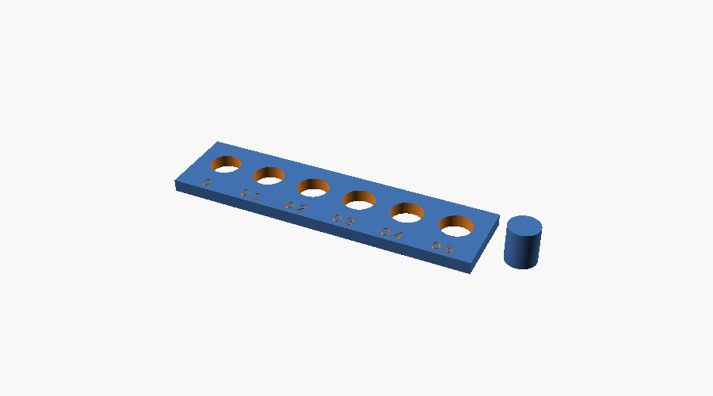

# Setting up: from our exact setup to whatever you have

*Part of the [Prompt to Bench](../README.md) tutorial · CC BY 4.0*

This page has three parts:

- [A](#a-our-exact-setup): how the author's setup works: Claude Code, an Original Prusa MK4, PrusaSlicer and OpenSCAD.
- [B](#b-any-printer-any-slicer-any-chatbot): the same workflow with whatever printer, slicer and AI you have, including free and offline options.
- [C](#c-calibrate-once-your-printer-facts-card): a 35-minute calibration print that makes every design fit better on *your* printer.

You do not need the setup in A. Most of the value is in B and C.

---

## A. Our exact setup

| Piece | What we use | Cost |
|---|---|---|
| AI assistant | [Claude Code](https://code.claude.com/docs/en/setup) in a terminal | needs a paid Claude plan (Pro, Max, Team, Enterprise) or an API account; not on the free plan; [supported countries](https://www.anthropic.com/supported-countries) only |
| CAD | [OpenSCAD](https://openscad.org/downloads.html) development snapshot (Manifold engine) | free |
| Slicer | [PrusaSlicer](https://github.com/prusa3d/PrusaSlicer/releases) (on Linux, the Flathub package `com.prusa3d.PrusaSlicer`) | free |
| Printer | Original Prusa MK4, 0.4 mm nozzle | about US$650-1,000 for the current MK4S |
| Checking | [`scadreport.py`](../tools/scadreport.py) from this repository (Python 3) | free |
| Computer | a 2022 Linux laptop, no GPU | |

### 1. Install the tools

```bash
# Claude Code (macOS, Linux, WSL). Windows PowerShell: irm https://claude.ai/install.ps1 | iex
curl -fsSL https://claude.ai/install.sh | bash
claude --version

# OpenSCAD: download a development snapshot for your system from
#   https://openscad.org/downloads.html  (section "Development Snapshots")
openscad --version

# PrusaSlicer on Linux via Flathub (or the installer for Windows/macOS)
flatpak install flathub com.prusa3d.PrusaSlicer

# this repository, for scadreport, the designs and the starter prompt
git clone https://github.com/ATinyGreenCell/prompt-to-bench.git
cd prompt-to-bench && python3 -m venv .venv && .venv/bin/pip install -r requirements.txt
```

Open PrusaSlicer once and run its configuration wizard for your printer. The wizard installs the printer profiles that the command line uses later.

### 2. Make a project folder that teaches Claude Code the workflow

Claude Code reads a file called `CLAUDE.md` in the folder you start it from and follows it. We provide one ([`claude-code/CLAUDE.md`](claude-code/CLAUDE.md)). It contains the design rules, the render-and-check loop, the PrusaSlicer command for an MK4, and safety rules for it to follow.

```bash
mkdir -p ~/lab-parts/parts ~/lab-parts/build && cd ~/lab-parts
cp ~/prompt-to-bench/tutorial/claude-code/CLAUDE.md .
cp ~/prompt-to-bench/tools/scadreport.py .
# edit the "Printer facts" block in CLAUDE.md with your printer and your coupon results (part C)
claude
```

### 3. Work

Inside Claude Code, describe the part:

> Design a rack for six 15 mL tubes (I measured 16.8 mm across). Two rows of three, 25 mm apart, plate on the bed, 60 mm tall walls. Print a test coupon of one hole first.

Claude Code writes `parts/<name>.scad`, renders it with OpenSCAD and checks it with `scadreport`. It fixes what does not match, shows you the numbers, and slices when you ask. It asks permission before running each new kind of command. Allow `openscad`, `python3 scadreport.py` and `prusa-slicer` once each, and read anything else before you approve it.

Open the `.scad` in OpenSCAD to look at the part yourself (F5 to preview, F6 to render), and send the G-code to the printer from PrusaSlicer or a USB stick.

This repository was itself built this way. Every prompt and reply is in [`meta/BUILD_LOG.md`](../meta/BUILD_LOG.md).

---

## B. Any printer, any slicer, any chatbot

The workflow does not depend on Claude Code or Prusa. It needs four things:

| You need | Free options |
|---|---|
| a 3D printer | your own, a shared lab printer, a university makerspace or FabLab |
| a slicer for that printer | PrusaSlicer, OrcaSlicer, Cura, Bambu Studio, or your printer maker's own |
| OpenSCAD | free on Windows, macOS and Linux ([openscad.org](https://openscad.org/downloads.html)) |
| an AI that writes code | any chatbot (free tiers included), or a local model through [Ollama](https://ollama.com) (see [tutorial Part 8](README.md#part-8-working-offline-with-a-free-local-model) for its current limits) |

With a chat window instead of Claude Code, *you* run the loop:

1. Copy the code into OpenSCAD and press F6.
2. Paste any errors back into the chat.
3. Check the part (by eye, or with `python scadreport.py part.scad`).
4. Export the STL (F7) and open it in your slicer.

### The setup assistant prompt

Paste this into any chatbot. It asks about your situation and writes you a personal setup plan:

````text
You are helping me set up a workflow for designing and 3D printing small parts for a
biology lab with OpenSCAD and an AI assistant. Ask me the following questions one at a
time, then write me a step-by-step setup plan:

1. My operating system and whether I can install software (admin rights?).
2. My printer (make, model, nozzle size) or the printer I have access to, and who runs it.
3. Which slicer I use, or whether I need one.
4. My internet access (always, sometimes, rarely; any data limits).
5. Which AI I can use (a hosted chatbot, a paid plan, or only offline models), and my
   computer's RAM and GPU if I want to run a model locally.
6. Which materials I can print (PLA, PETG, ...) and what the parts will be used for
   (heat, chemicals, sterile work).
7. My experience with 3D printing and with code (none is fine).

The plan must include:
- exact install steps for OpenSCAD and my slicer on my system, and how to load my printer's profile;
- how to run the loop: describe the part with measured numbers -> AI writes OpenSCAD -> I render
  in OpenSCAD (F6) -> paste errors back -> check the size -> export STL (F7) -> slice -> print a
  small test coupon of the critical feature first;
- a short calibration: print a clearance coupon (a plate with holes 0.0-1.0 mm larger than a
  10 mm peg) and record my press, sliding and loose fits;
- a "printer facts" card I can paste at the top of every future design request (printer, nozzle,
  build volume, material, my measured clearances, max overhang about 45 degrees, minimum wall
  2 x nozzle width);
- what NOT to print for a lab (centrifuge rotors and adapters, pressure vessels, mains-voltage
  enclosures, anything touching patients) and the material limits that matter for my uses.
Keep it practical and short. Use plain language. If I am offline most of the time, plan for
downloading everything once (or getting it on a USB stick).
````

### The starter prompt for every design

Use the starter prompt from [tutorial Part 2](README.md#step-2---give-the-model-its-instructions-the-starter-prompt) at the start of every design chat, followed by your printer facts card (part C) and the request.

---

## C. Calibrate once: your printer facts card

Every printer and material prints holes a little differently. Measure yours once:

1. Print [`designs/calibration/clearance_coupon.scad`](../designs/calibration/clearance_coupon.scad) (about 35 minutes) with your normal settings and material. It is a plate with six holes for a 10 mm peg, from +0.0 to +1.0 mm on the diameter, and the peg itself. Push the peg's top end in from the plate's top face.

   

2. Try the peg in each hole and note:
   - **press fit:** the smallest hole the peg enters with firm pressure;
   - **sliding fit:** the smallest hole it slides through freely;
   - **loose fit:** the smallest hole it drops through by itself.

   The clearance *per side* is half the number engraved by the hole.
3. Fill in this card and keep it. Paste it at the top of every design request, or into the "Printer facts" block of `CLAUDE.md`:

```text
PRINTER FACTS
Printer: <make/model>, <nozzle> mm nozzle, build volume <X x Y x Z> mm
Slicer: <name>, profile <name>
Material: <PLA/PETG/...>
Clearance per side (measured): press <a> mm, sliding <b> mm, loose <c> mm
Design rules: overhangs <= 45 deg without supports; walls >= <2 x nozzle> mm; flat face on the bed
```

Repeat the coupon for each material you use: PETG usually needs a little more clearance than PLA.
